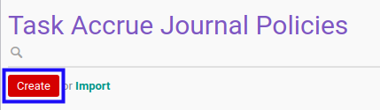

# Membuat Accrue Entry Journal Policy

## A. INPUT

*(Tidak ada instruksi khusus)*

## B. LANGKAH KERJA

1. Buka menu **Project -> Configuration -> Accrue Entry -> Journal Policies**. Abaikan jika sudah berada pada menu yang dimaksud.
2. Klik tombol **Create** pada bagian atas-kiri form.

3. Isi **[Policy](./penjelasan.md#field-policy)**. Wajib diisi.
4. Isi **[Code](./penjelasan.md#field-code)**. Wajib diisi.
5. Aktifkan/ Deaktifkan **[Active](./penjelasan.md#field-active)**. Tidak wajib diisi.
6. Pilih **[Computation Method](./penjelasan.md#field-computation-method)**. Wajib diisi.
7. Beralih ke tab **[Python Code](./penjelasan.md#tab-python-code)**.
8. Isi **[Python Code](./penjelasan.md#field-python-code)**. Tidak wajib diisi.
9. Beralih ke tab **[Note](./penjelasan.md#tab-note)**.
10. Isi **[Note](./penjelasan.md#field-note)**. Tidak wajib diisi.
11. Klik tombol **Save** pada bagian atas-kiri form.

## C. OUTPUT

* Data *Accrue Entry Journal Policy* akan terbuat.
