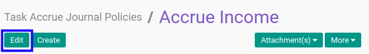

# Memodifikasi Accrue Entry Journal Policy

## A. INPUT

* User yang akan memodifikasi harus memiliki akses untuk memodifikasi *Accrue Entry Journal Policy*.

## B. LANGKAH KERJA

1. Buka menu **Project -> Configuration -> Accrue Entry -> Journal Policies**. Abaikan jika sudah berada pada menu yang dimaksud.
2. Buka data *Accrue Entry Journal Policy* yang akan dimodifikasi. Abaikan jika data sudah dibuka.
3. Klik tombol **Edit** pada bagian atas-kiri form.

4. Isi dan sesuaikan **[Policy](./penjelasan.md#field-policy)** jika dibutuhkan. Wajib diisi.
5. Isi dan sesuaikan **[Code](./penjelasan.md#field-code)** jika dibutuhkan. Wajib diisi.
6. Aktifkan/ Deaktifkan **[Active](./penjelasan.md#field-active)** jika dibutuhkan. Tidak wajib diisi.
7. Pilih dan sesuaikan **[Computation Method](./penjelasan.md#field-computation-method)** jika dibutuhkan. Wajib diisi.
8. Beralih ke tab **[Python Code](./penjelasan.md#tab-python-code)**.
9. Isi dan sesuaikan **[Python Code](./penjelasan.md#field-python-code)** jika dibutuhkan. Tidak wajib diisi.
10. Beralih ke tab **[Note](./penjelasan.md#tab-note)**.
11. Isi dan sesuaikan **[Note](./penjelasan.md#field-note)** jika dibutuhkan. Tidak wajib diisi.
12. Klik tombol **Save** pada bagian atas-kiri form.

## C. OUTPUT

* Data *Accrue Entry Journal Policy* akan berubah sesuai dengan perubahan yang dilakukan.
