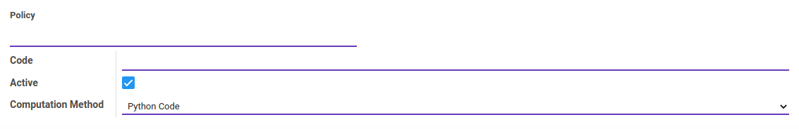
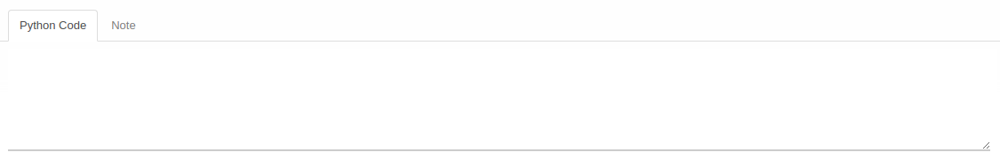
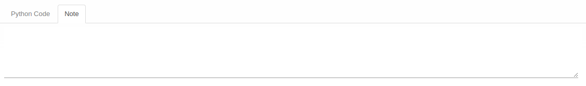

# Penjelasan Accrue Entry Journal Policy

Informasi pada *Accrue Entry Journal Policy* dibagi menjadi beberapa bagian, yaitu:

  * [Header](#bagian-header)
  * [Tab Python Code](#tab-python-code)
  * [Tab Note](#tab-note)

### <a name="bagian-header">HEADER</a>

#### <a name="field-policy">Policy</a>

Nama policy.

#### <a name="field-code">Code</a>

Kode policy.

#### <a name="field-active">Active</a>

Penanda status accrue entry journal policy aktif.

#### <a name="field-computation-method">Computation Method</a>

Metode perhitungan.

#### <a name="tab-python-code">PYTHON CODE</a>

#### <a name="field-python-code">Python Code</a>

Kode python untuk perhitungan accrue entry journal policy.

#### <a name="tab-note">NOTE</a>

#### <a name="field-note">Note</a>

Catatan.
