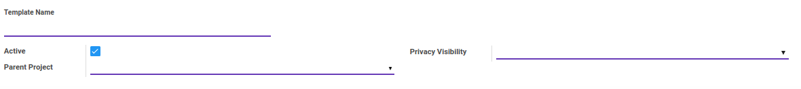
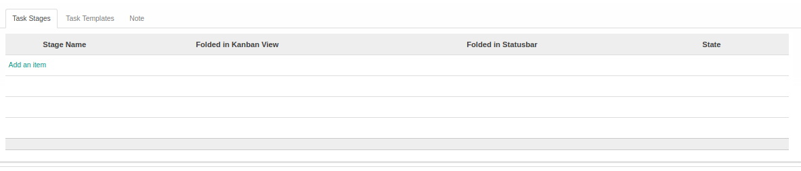
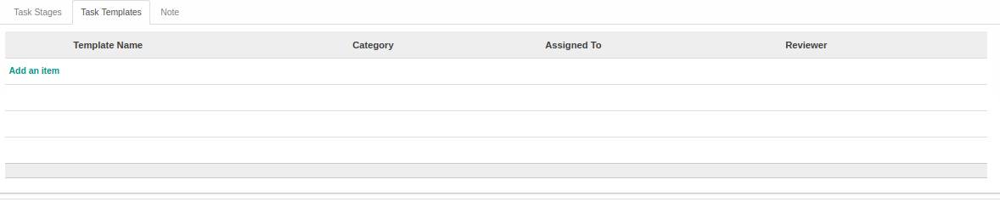
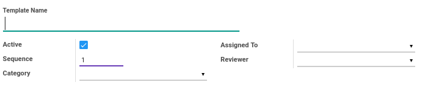
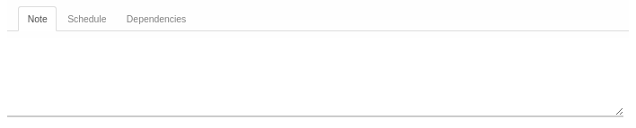
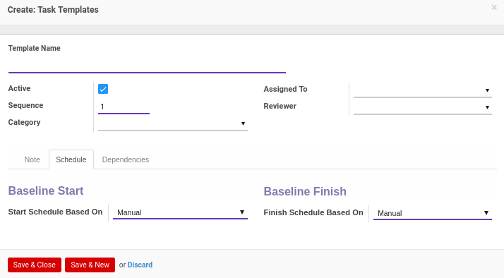
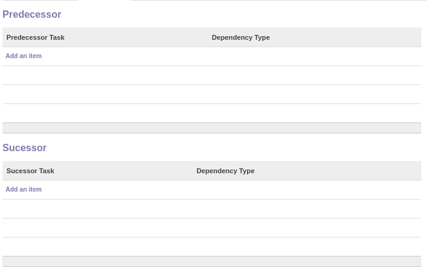
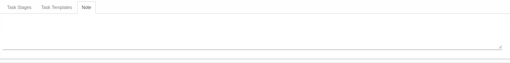

# Project Template

Informasi pada Template Proyek dibagi menjadi beberapa area, diantaranya:

* [Header](#bagian-header)
* [Tab Task Stages](#tab-task-stages)
* [Tab Task Templates](#tab-task-templates)
* [Tab Note](#tab-note)

### <a name="bagian-header">HEADER</a>

#### <a name="field-name">Template Name</a>

Nama template proyek

#### <a name="field-active">Active</a>

Sebagai penanda apakah data adalah aktif/non-aktif

#### <a name="field-parent-project-id">Parent Project</a>

Parent/Induk Proyek

#### <a name="field-privacy-visibility">Privacy Visibility</a>

Terbagi atas 3 pilihan, yaitu: 
* **Public:** Jika dipilih, maka proyek akan bersifat publik
* **Employees:** Jika dipilih, maka proyek hanya dapat diakses oleh karyawan saja
* **Followers:** Jika dipilih, maka proyek hanya dapat diakses oleh *Followers* saja

### <a name="tab-task-stages">Tab Task Stages</a>

#### <a name="field-task-type-ids">Task Stages</a>

Mendefinisikan *Task Stage*

### <a name="tab-task-templates">Tab Task Templates</a>

Informasi pada Tab Task Templates dibagi menjadi beberapa area, diantaranya:

* [Header](#tab-task-templates-header)
* [Tab Note](#tab-task-templates-note)
* [Tab Schedule](#tab-task-templates-form-schedule)
* [Tab Dependencies](#tab-task-templates-form-dependencies)

### <a name="tab-task-templates-header">Tab Task Templates: Header</a>

#### <a name="field-task-templates-header-name">Template Name</a>

Nama template tugas

#### <a name="field-task-templates-header-active">Active</a>

Sebagai penanda apakah data adalah aktif/non-aktif

#### <a name="field-task-templates-header-sequence">Sequence</a>

No. Urut

#### <a name="field-task-templates-header-categ-id">Category</a>

Mendefiniskan kategori tugas

#### <a name="field-task-templates-header-user-id">Assigned To</a>

Mendefiniskan *User*(Pengguna) yang akan ditugaskan

#### <a name="field-task-templates-header-reviewer-id">Reviewer</a>

Mendefiniskan *User*(Pengguna) yang akan menjadi *Reviewer*(peninjau) tugas

### <a name="tab-task-templates-note">Tab Task Templates: Tab Note</a>

#### <a name="field-tab-task-templates-note">Note</a>

Catatan tambahan terkait *Task Template*

### <a name="tab-task-templates-form-schedule">Tab Task Templates: Tab Schedule</a>

#### <a name="field-start-schedule-based-on">Start Schedule Based On</a>

Mendefinisikan dasar akan dimulainya *Schedule*: Terbagi atas 5 pilihan, yaitu: 
* **Manual**
* **Task Baseline Start**
* **Task Baseline Finish**
* **Project Baseline Start**
* **Project Baseline Finish**

#### <a name="field-finish-schedule-based-on">Finish Schedule Based On</a>

Mendefinisikan dasar akan berakhirnya *Schedule*: Terbagi atas 5 pilihan, yaitu: 
* **Manual**
* **Task Baseline Start**
* **Task Baseline Finish**
* **Project Baseline Start**
* **Project Baseline Finish**

### <a name="tab-task-templates-form-dependencies">Tab Task Templates: Tab Dependencies</a>

### <a name="bagian-predecessor">PREDECESSOR</a>

### <a name="field-predecessor-task-id">Predecessor Task</a>

Mendefinisikan *Predecessor Task*

### <a name="field-dependency-Type">Dependency Type</a>

Tipe *Dependency*. Terbagi atas 4 pilihan, yaitu: 
* **Start-To-Finish**
* **Start-To-Start**
* **Finish-To-Start**
* **Finish-To-Finish**

### <a name="bagian-predecessor">SUCESSOR</a>

### <a name="field-sucessor-task-id">Sucessor Task</a>

Mendefinisikan *Sucessor Task*

### <a name="field-dependency-Type">Dependency Type</a>

Tipe *Dependency*. Terbagi atas 4 pilihan, yaitu: 
* **Start-To-Finish**
* **Start-To-Start**
* **Finish-To-Start**
* **Finish-To-Finish**

### <a name="tab-note">Tab Note</a>

#### <a name="field-tab-note">Note</a>

Catatan tambahan terkait *Project Template*