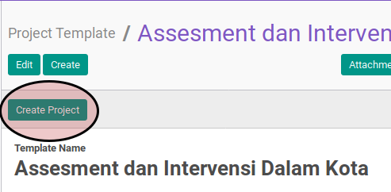
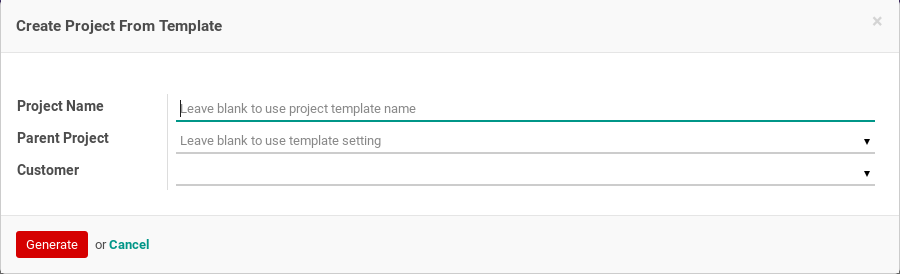
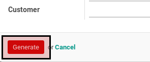

# Membuat Project Dari Project Template

## A. INPUT

*(Tidak ada instruksi khusus)*

## B. LANGKAH KERJA

1. Buka menu **Project -> Configuration -> Project Template**. Abaikan jika menu sudah dibuka.
2. Buka data project template yang akan dimodifikasi. Abaikan jika data sudah dibuka.
3. Klik tombol **Create Project** pada bagian atas-kiri form.

4. Pop-up **Create Project From Template** akan muncul.

5. Isi **Project Name**. Tidak harus diisi.
6. Pilih **Parent Project**. Tidak harus diisi.
7. Pilih **Customer**. Tidak harus diisi.
8. Klik tombol **Generate Project** pada bagian bawah-kiri pop-up **Create Project From Template**

## C. OUTPUT

* Data project akan terbuat sesuai dengan project template yang digunakan.
