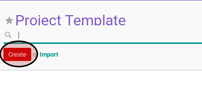

# Membuat Project Template

## A. INPUT

*(Tidak ada instruksi khusus)*

## B. LANGKAH KERJA

1. Buka menu **Project -> Configuration -> Project Template**. Abaikan jika menu sudah dibuka.
2. Klik tombol **Create** pada bagian atas-kiri form.

3. Isi **Template Name**. Harus diisi.
4. Aktifkan **Active**.
5. Pilih **Parent Project**. Harus diisi.
6. Pilih **Privacy Visibility**. Harus diisi.
7. Buka tab **Task Stages**.
8. <a name="l7">[Tambah](./menambahkan-stage.md)/[Hapus](./menghapus-stages.md)</a> **Project Stages**. Ulangi langkah ini sampai **Project Stages** sesuai keinginan.
9. Buka tab **Task Template**.
10. <a name="l10">[Tambah](./menambah-task-template.md)/[Modifikasi](./memodifikasi-task-template.md)/[Hapus](./menghapus-task-template.md)</a> tabel **Task Template**. Ulangi langkah ini sampai tabel **Task Template** sesuai dengan keinginan.
11. Buka tab **Note**
12. Isi **Note**. Tidak harus diisi.
13. Klik tombol **Save** pada bagian atas-kiri form.

## C. OUTPUT

* Data project template akan terbuat.
