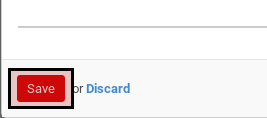

# Memodifikasi Task Template

*(Instruksi kerja ini merupakan sub instruksi dari (1) [Membuat Project Template](./membuat.md), atau (2) [Memodifikasi Project Template](./memodifikasi.md). Instruksi kerja ini tidak bisa berdiri sendiri)*

## A. INPUT

*(Tidak ada instruksi khusus)*

## B. LANGKAH KERJA

1. Buka tab **Task Templates**.
2. Buka data task template yang akan dimodifikasi.
3. Pop-up **Task Template** akan muncul.

4. Isi dan sesuaikan **Task Template** jika dibutuhkan. Harus diisi.
5. Aktifkan **Active**.
6. Isi dan sesuaikan **Sequence** jika dibutuhkan. Harus diisi.
7. Pilih dan sesuaikan **Category** jika dibutuhkan. Tidak harus diisi.
8. Pilih dan sesuaikan **Assigned To** jika dibutuhkan. Tidak harus diisi.
9. Pilih dan sesuaikan **Reviewer** jika dibutuhkan. Tidak harus diisi.
10. Buka tab **Notes**.
11. Isi dan sesuaikan **Notes** jika dibutuhkan. Tidak harus diisi.
12. Buka tab **Dependencies**.
13. [Tambah](./menambah-task-template-dependency.md)/[Modifikasi](./memodifikasi-task-template-dependency.md)/[Hapus](./menghapus-task-template-dependency.md) Task Dependency. Ulangi langkah ini sampai tabel **Task Dependency** sesuai keinginan.
14. Buka tab **Schedule**
15. Pilih dan sesuaikan [**Start Schedule Based On**](./penjelasan.md#field-start-schedule-base-on) jika dibutuhkan. Harus diisi. Lanjutkan ke langkah ke-16 apabila isian sama dengan **Manual**. Lanjutkan ke langkah ke-17 apabila isian tidak sama dengan **Manual**. Harus diisi.
16. Isi dan sesuaikan [**Manual Baseline Start**](./penjelasan.md#field-manual-baseline-start) jika dibutuhkan. Lanjutkan ke langkah ke-20. Harus diisi.
17. Pilih dan sesuaikan [**Task Based Schedule**](./penjelasan.md#field-task-based-schedule-start) jika dibutuhkan. Harus diisi.
18. Pilih dan sesuaikan [**Baseline Start Offset**](./penjelasan.md#field-baseline-start-offset) jika dibutuhkan. Harus diisi.
19. Pilih dan sesuaikan [**Baseline Start Offset UoM**](./penjelasan.md#field-baseline-start-offset-uom) jika dibutuhkan. Harus diisi.
20. Pilih dan sesuaikan [**Finish Schedule Based On**](./penjelasan.md#field-finish-schedule-based-on) jika dibutuhkan. Harus diisi. Lanjutkan ke langkah ke-21 apabila isian sama dengan **Manual**. Lanjutkan ke langkah ke-22 apabila isian tidak sama dengan **Manual**.
21. Isi dan sesuaikan [**Manual Baseline Finish**](./penjelasan.md#field-manual-baseline-finish) jika dibutuhkan. Lanjutkan ke langkah ke-35. Harus diisi.
22. Pilih dan sesuaikan [**Task Based Schedule**](./penjelasan.md#field-task-based-schedule-finish) jika dibutuhkan. Harus diisi.
23. Pilih dan sesuaikan [**Baseline Finish Offset**](./penjelasan.md#field-baseline-finish-offset) jika dibutuhkan. Harus diisi.
24. Pilih dan sesuaikan [**Baseline Finish Offset UoM**](./penjelasan.md#field-baseline-finish-offset-uom) jika dibutuhkan. Harus diisi.
25. Klik tombol **Save** pada bagian bawah-kiri form. Lanjutkan [langkah ke-10 instruksi kerja Membuat Task template](./membuat.md#l10) atau [langkah ke-10 instruksi kerja Memodifikasi task Template](./memodifikasi.md#l10).

## C. OUTPUT

*(Tidak ada instruksi khusus)*
