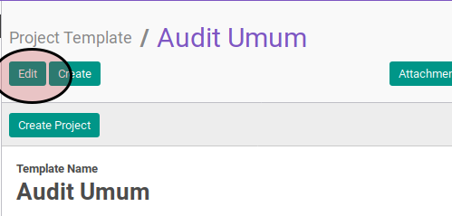
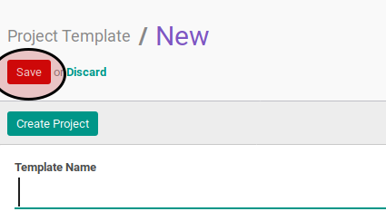

# Memodifikasi Project Template

## A. INPUT

*(Tidak ada instruksi khusus)*

## B. LANGKAH KERJA

1. Buka menu **Project -> Configuration -> Project Template**. Abaikan jika menu sudah dibuka.
2. Buka data project template yang akan dimodifikasi. Abaikan jika data sudah dibuka.
3. Klik tombol **Edit** pada bagian atas-kiri form.

4. Isi dan sesuaikan **Template Name** jika dibutuhkan. Harus diisi.
5. Pilih dan sesuaikan **Parent Project** jika dibutuhkan. Harus diisi.
6. Pilih dan sesuaikan **Privacy Visibility** jika dibutuhkan. Harus diisi.
7. Buka tab **Task Stages**.
8. <a name="l7">[Tambah](./menambahkan-stage.md)/[Hapus](./menghapus-stages.md)</a> **Project Stages**. Ulangi langkah ini sampai **Project Stages** sesuai keinginan.
9. Buka tab **Task Template**.
10. <a name="l10">[Tambah](./menambah-task-template.md)/[Modifikasi](./memodifikasi-task-template.md)/[Hapus](./menghapus-task-template.md)</a> tabel **Task Template**. Ulangi langkah ini sampai tabel **Task Template** sesuai dengan keinginan.
11. Buka tab **Note**
12. Isi dan sesuaikan **Note** jika dibutuhkan. Tidak harus diisi.
13. Klik tombol **Save** pada bagian atas-kiri form.

## C. OUTPUT

* Data project template akan berubah sesuai dengan keinginan.
