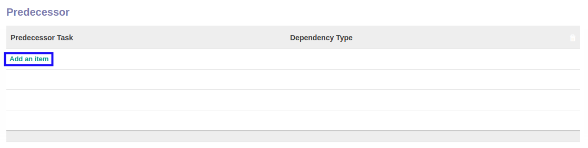
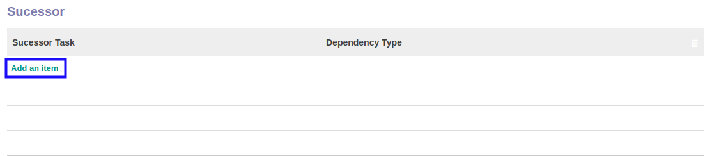

# Menambahkan Task Template Dependency

*(Instruksi kerja ini merupakan sub instruksi dari (1) [Menambahkan Task Template](./menambah-task-template.md), atau (2) [Memodifikasi Task Template](./memodifikasi-task-template.md). Instruksi kerja ini tidak bisa berdiri sendiri)*

## A. INPUT

*(Tidak ada instruksi khusus)*

## B. LANGKAH KERJA

1. Klik tombol **Add an Item** pada tabel **Predecessor**.

2. Pilih **[Predecessor Task](./penjelasan.md#field-predecessor-task-id)**. Wajib diisi.
3. Pilih **[Dependency Type](./penjelasan.md#field-dependency-Type)**. Wajib diisi.

4. Klik tombol **Add an Item** pada tabel **Sucessor**.

5. Pilih **[Sucessor Task](./penjelasan.md#field-sucessor-task-id)**. Wajib diisi.
6. Pilih **[Dependency Type](./penjelasan.md#field-dependency-Type)**. Wajib diisi.
7. Lanjutkan [langkah ke-13 instruksi kerja Menambahkan Task Template](./menambah-task-template.md) atau [langkah ke-13 instruksi kerja Memodifikasi Task Template](./memodifikasi-task-template.md).
