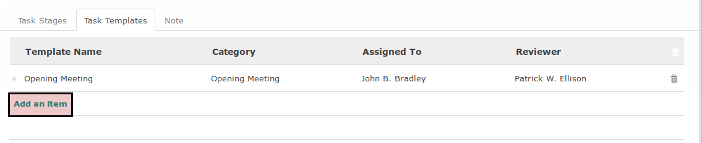
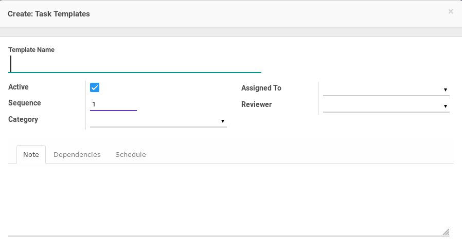

# Menambahkan Task Template

*(Instruksi kerja ini merupakan sub instruksi dari (1) [Membuat Project Template](./membuat.md), atau (2) [Memodifikasi Project Template](./memodifikasi.md). Instruksi kerja ini tidak bisa berdiri sendiri)*

## A. INPUT

*(Tidak ada instruksi khusus)*

## B. LANGKAH KERJA

1. Buka tab **Task Templates**.
2. Klik tombol **Add an Item** pada tabel **Task Template**.

3. Pop-up **Task Template** akan muncul.

4. Isi **Task Template**. Harus diisi.
5. Aktifkan **Active**.
6. Isi **Sequence**. Harus diisi.
7. Pilih **Category**. Tidak harus diisi.
8. Pilih **Assigned To**. Tidak harus diisi.
9. Pilih **Reviewer**. Tidak harus diisi.
10. Buka tab **Notes**.
11. Isi **Notes**. Tidak harus diisi.
12. Buka tab **Dependencies**.
13. [Tambah](./menambah-task-template-dependency.md)/[Modifikasi](./memodifikasi-task-template-dependency.md)/[Hapus](./menghapus-task-template-dependency.md) Task Dependency. Ulangi langkah ini sampai tabel **Task Dependency** sesuai keinginan.
14. Buka tab **Schedule**
15. Pilih [**Start Schedule Based On**](./penjelasan.md#field-start-schedule-base-on). Harus diisi. Lanjutkan ke langkah ke-16 apabila isian sama dengan **Manual**. Lanjutkan ke langkah ke-17 apabila isian tidak sama dengan **Manual**. Harus diisi.
16. Isi [**Manual Baseline Start**](./penjelasan.md#field-manual-baseline-start). Lanjutkan ke langkah ke-20. Harus diisi.
17. Pilih [**Task Based Schedule**](./penjelasan.md#field-task-based-schedule-start). Harus diisi.
18. Pilih [**Baseline Start Offset**](./penjelasan.md#field-baseline-start-offset). Harus diisi.
19. Pilih [**Baseline Start Offset UoM**](./penjelasan.md#field-baseline-start-offset-uom). Harus diisi.
20. Pilih [**Finish Schedule Based On**](./penjelasan.md#field-finish-schedule-based-on). Harus diisi. Lanjutkan ke langkah ke-21 apabila isian sama dengan **Manual**. Lanjutkan ke langkah ke-22 apabila isian tidak sama dengan **Manual**.
21. Isi [**Manual Baseline Finish**](./penjelasan.md#field-manual-baseline-finish). Lanjutkan ke langkah ke-35. Harus diisi.
22. Pilih [**Task Based Schedule**](./penjelasan.md#field-task-based-schedule-finish). Harus diisi.
23. Pilih [**Baseline Finish Offset**](./penjelasan.md#field-baseline-finish-offset). Harus diisi.
24. Pilih [**Baseline Finish Offset UoM**](./penjelasan.md#field-baseline-finish-offset-uom). Harus diisi.
25. Klik tombol **Save & New** atau **Save & Close**.

26. Ulangi langkah ke-4 jika tombol **Save & New** yang dipilih pada langkah ke-25. Lanjutkan [langkah ke-10 instruksi kerja Membuat Task template](./membuat.md#l10) atau [langkah ke-10 instruksi kerja Memodifikasi task Template](./memodifikasi.md#l10).

## C. OUTPUT

*(Tidak ada instruksi khusus)*
