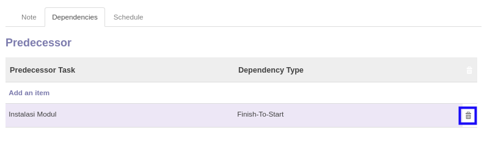

# Menghapus Task Template Dependency

*(Instruksi kerja ini merupakan sub instruksi dari (1) [Menambahkan Task Template](./menambah-task-template.md), atau (2) [Memodifikasi Task Template](./memodifikasi-task-template.md). Instruksi kerja ini tidak bisa berdiri sendiri)*

## A. INPUT

*(Tidak ada instruksi khusus)*

## B. LANGKAH KERJA

1. Klik icon tempat sampah pada bagian kanan data **Dependencies** yang akan dihapus.

2. Lanjutkan [langkah ke-13 instruksi kerja Menambahkan Task Template](./menambah-task-template.md) atau [langkah ke-13 instruksi kerja Memodifikasi Task Template](./memodifikasi-task-template.md).

## C. OUTPUT

*(Tidak ada instruksi khusus)*
