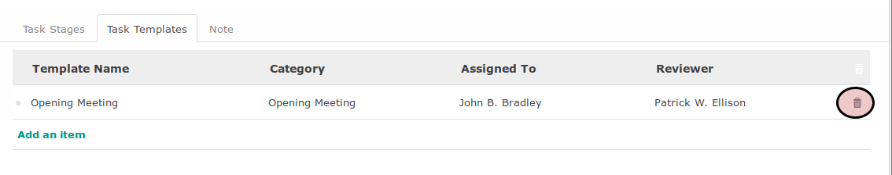

# Menghapus Task Template

*(Instruksi kerja ini merupakan sub instruksi dari (1) [Membuat Project Template](./membuat.md), atau (2) [Memodifikasi Project Template](./memodifikasi.md). Instruksi kerja ini tidak bisa berdiri sendiri)*

## A. INPUT

*(Tidak ada instruksi khusus)*

## B. LANGKAH KERJA

1. Buka tab **Task Templates**.
2. Klik icon tempat sampah pada bagian kanan data task template yang akan dihapus.

3. Lanjutkan [langkah ke-10 instruksi kerja Membuat Task template](./membuat.md#l10) atau [langkah ke-10 instruksi kerja Memodifikasi task Template](./memodifikasi.md#l10).

## C. OUTPUT

* Data task template akan terhapus.
