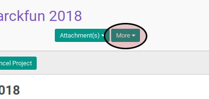

# Menghapus Project Template

## A. INPUT

*(Tidak ada instruksi khusus)*

## B. LANGKAH KERJA

1. Buka menu **Project -> Configuration -> Project Template**. Abaikan jika sudah berada pada menu yang dimaksud.
2. Buka data project template yang akan dihapus. Abaikan jika data sudah dibuka.
3. Klik tombol **More** pada bagian atas-tengah form.

4. Klik tombol **Delete** pada drop-down yang muncul pada tombol **More**.

5. Klik **Ok** pada diaalog konfirmasi penghapusan.

## C. OUTPUT

* Data project template akan terhapus.
