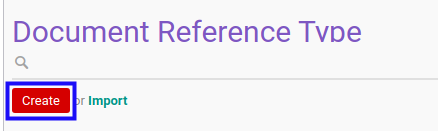

# Membuat Reference Document Type

## A. INPUT

*(Tidak ada instruksi khusus)*

## B. LANGKAH KERJA

1. Buka menu **Project -> Configuration -> Reference Document Type**. Abaikan jika sudah berada pada menu yang dimaksud.
2. Klik tombol **Create** pada bagian atas-kiri form.

3. Isi **[Reference Document Type](./penjelasan.md#field-ref-doc-type)**. Wajib diisi.
4. Aktifkan/ Deaktifkan **[Active](./penjelasan.md#field-active)**. Tidak wajib diisi.
5. Beralih ke tab **[Note](./penjelasan.md#tab-note)**.
6. Isi **[Note](./penjelasan.md#field-note)**. Tidak wajib diisi.
7. Klik tombol **Save** pada bagian atas-kiri form.

## C. OUTPUT

* Data *Reference Document Type* akan terbuat.
