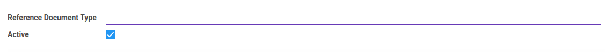
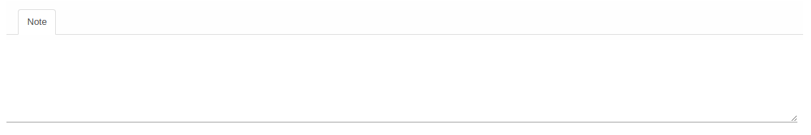

# Penjelasan Reference Document Type

Informasi pada *Reference Document Type* dibagi menjadi beberapa bagian, yaitu:

* [Header](#bagian-header)
* [Tab Note](#tab-note)

### <a name="bagian-header">HEADER</a>

#### <a name="field-ref-doc-type">Reference Document Type</a>

Tipe referensi dokumen.

#### <a name="field-active">Active</a>

Penanda status Reference Document Type aktif.

#### <a name="tab-note">TAB NOTE</a>

#### <a name="field-note">Note</a>

Catatan.
