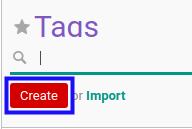

# Membuat Project Tag

## A. INPUT

*(Tidak ada instruksi khusus)*

## B. LANGKAH KERJA

1. Buka menu **Project -> Configuration -> Tags**. Abaikan jika sudah berada pada menu yang dimaksud.
2. Klik tombol **Create** pada bagian atas-kiri form.

3. Isi **[Name](./penjelasan.md#field-name)**. Wajib diisi.
4. Klik tombol **Save** pada bagian atas-kiri form.

## C. OUTPUT

* Data *Project Tag* akan terbuat.
