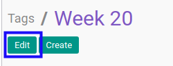
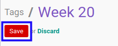

# Memodifikasi Project Tag

## A. INPUT

* User yang akan memodifikasi harus memiliki akses untuk memodifikasi *Project Tag*.

## B. LANGKAH KERJA

1. Buka menu **Project -> Configuration -> Tags**. Abaikan jika sudah berada pada menu yang dimaksud.
2. Buka data *Project Tags* yang akan dimodifikasi. Abaikan jika data sudah dibuka.
3. Klik tombol **Edit** pada bagian atas-kiri form.

4. Isi dan sesuaikan **[Name](./penjelasan.md#field-name)** jika dibutuhkan. Wajib diisi.
5. Klik tombol **Save** pada bagian atas-kiri form.

## C. OUTPUT

* Data *Project Tag* akan berubah sesuai dengan perubahan yang dilakukan.
