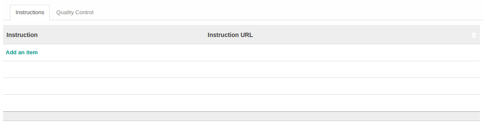

# Task Category

Informasi pada *Task Category* dibagi menjadi beberapa area, diantaranya:

* [Header](#bagian-header)
* [Tab Quality Control](#tab-quality-control)
* [Tab Instructions](#tab-instructions)

### <a name="bagian-header">HEADER</a>

#### <a name="field-name">Name</a>

Nama *Task Category*

### <a name="tab-quality-control">TAB QUALITY CONTROL</a>

#### <a name="field-qc-name">Question</a>

Mendefinisikan pertanyaan yang akan diberikan pada saat melakukan *Quality Control*

#### <a name="field-qc-sequence">Sequence</a>

No. Urut

#### <a name="field-qc-type">Type</a>

Tipe *Quality Control*. Terbagi atas 2 pilihan, yaitu: 
* **Qualitative**
* **Quantitative**

#### <a name="field-qc-notes">Note</a>

Catatan tambahan

### <a name="tab-instructions">TAB INSTRUCTIONS</a>

#### <a name="field-instruction-name">Instruction</a>

Nama instruksi

#### <a name="field-instruction-url">Instruction URL</a>

Alamat URL instruksi