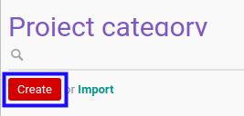

# Membuat Task Category

## A. INPUT

*(Tidak ada instruksi khusus)*

## B. LANGKAH KERJA

1. Buka menu **Project -> Configuration -> Task Category**. Abaikan jika sudah berada pada menu yang dimaksud.
2. Klik tombol **Create** pada bagian atas-kiri form.

3. Isi **[Name](./penjelasan.md#field-name)**. Wajib diisi.
4. Beralih ke tab **[Instructions](./penjelasan.md#tab-instructions)**.
5. <a name="l5">[Tambah](./menambah-instruction.md)/[Modifikasi](./memodifikasi-instruction.md)/[Hapus](./menghapus-instruction.md) **Instructions**</a>. Ulangi langkah ini sampai **Instructions** sesuai dengan keinginan.
6. Beralih ke tab **[Quality Control](./penjelasan.md#tab-quality-control)**.
7. <a name="l7">[Tambah](./menambah-pertanyaan.md)/[Modifikasi](./memodifikasi-pertanyaan.md)/[Hapus](./menghapus-pertanyaan.md) **Question**</a>. Ulangi langkah ini sampai **Question** sesuai dengan keinginan.
8. Klik tombol **Save** pada bagian atas-kiri form.

## C. OUTPUT

* Data *Task Category* akan terbuat.
