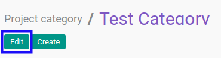
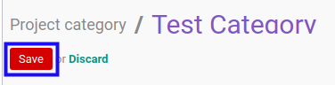

# Memodifikasi Task Category

## A. INPUT

* User yang akan memodifikasi harus memiliki akses untuk memodifikasi *Task Category*.

## B. LANGKAH KERJA

1. Buka menu **Project -> Configuration -> Task Category**. Abaikan jika sudah berada pada menu yang dimaksud.
2. Buka data *Task Category* yang akan dimodifikasi. Abaikan jika data sudah dibuka.
3. Klik tombol **Edit** pada bagian atas-kiri form.

4. Isi dan sesuaikan **[Name](./penjelasan.md#field-name)** jika dibutuhkan. Wajib diisi.
5. Beralih ke tab **[Instructions](./penjelasan.md#tab-instructions)**.
6. <a name="l6">[Tambah](./menambah-instruction.md)/[Modifikasi](./memodifikasi-instruction.md)/[Hapus](./menghapus-instruction.md) **Instructions**</a>. Ulangi langkah ini sampai **Instructions** sesuai dengan keinginan.
7. Beralih ke tab **[Quality Control](./penjelasan.md#tab-quality-control)**.
8. <a name="l8">[Tambah](./menambah-pertanyaan.md)/[Modifikasi](./memodifikasi-pertanyaan.md)/[Hapus](./menghapus-pertanyaan.md) **Question**</a>. Ulangi langkah ini sampai **Question** sesuai dengan keinginan.
9. Klik tombol **Save** pada bagian atas-kiri form.

## C. OUTPUT

* Data *Task Category* akan berubah sesuai dengan perubahan yang dilakukan.
