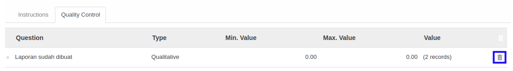

# Menghapus Pertanyaan

*(Instruksi kerja ini merupakan sub instruksi dari (1) [Membuat Task Category](./membuat.md), atau (2) [Memodifikasi Task Category](./memodifikasi.md). Instruksi kerja ini tidak bisa berdiri sendiri)*

## A. INPUT

*(Tidak ada instruksi khusus)*

## B. LANGKAH KERJA

1. Klik icon tempat sampah pada bagian kanan data **Question** yang akan dihapus.

2. Ulangi langkah ke-1 untuk setiap **Question** yang akan dihapus.
3. Lanjutkan [langkah ke-7 instruksi kerja Membuat Task Category](./membuat.md#l7) atau [langkah ke-8 instruksi kerja Memodifikasi Task Category](./memodifikasi.md#l8).

## C. OUTPUT

*(Tidak ada instruksi khusus)*
