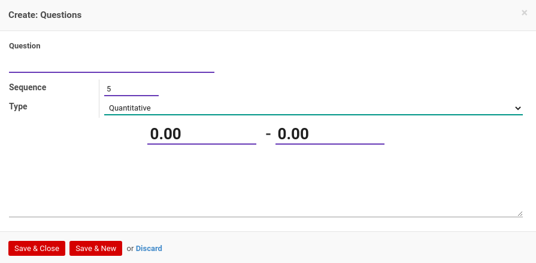

# Penjelasan Task Category

Informasi pada *Task Category* dibagi menjadi beberapa area, diantaranya:

* [Header](#bagian-header)
* [Tab Instructions](#tab-instructions)
* [Tab Quality Control](#tab-quality-control)

### <a name="bagian-header">HEADER</a>

#### <a name="field-name">Name</a>

Nama *Task Category*

### <a name="tab-instructions">TAB INSTRUCTIONS</a>

#### <a name="field-instruction-name">Instruction</a>

Nama instruksi

#### <a name="field-instruction-url">Instruction URL</a>

Alamat URL instruksi

### <a name="tab-quality-control">TAB QUALITY CONTROL</a>

#### <a name="field-qc-name">Question</a>

Pertanyaan yang akan diberikan pada saat melakukan *Quality Control*

#### <a name="field-qc-sequence">Sequence</a>

No. Urut

#### <a name="field-qc-type">Type</a>

Tipe *Quality Control*, yaitu: 
* **Qualitative**. Pertanyaan QC harus dijawab dengan cara memilih pilihan yang disediakan.
* **Quantitative**. Pertanyaan QC harus dijawab dengan mengisi nilai

#### <a name="field-min-value">Min. Value</a>

Nilai minimum jawaban. Diperlukan jika **Type** adalah **Quantitative**.

#### <a name="field-max-value">Max. Value</a>

Nilai maksimum jawaban. Diperlukan jika **Type** adalah **Quantitative**.

#### <a name="field-value">Value</a>

Jawaban. Diperlukan jika **Type** adalah **Qualitative**.

#### <a name="field-correct-answer">Correct Answer</a>

Penanda jawaban yang benar. Diperlukan jika **Type** adalah **Qualitative**.
