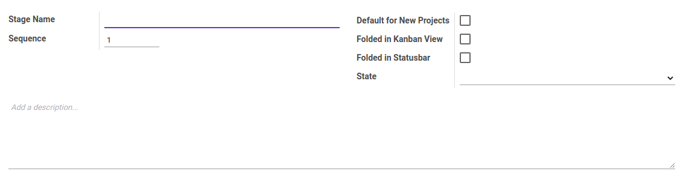

# Task Stage

### <a name="bagian-header">HEADER</a>

#### <a name="field-name">Stage Name</a>

Nama *Stage*(Tahapan) dari project

#### <a name="field-sequence">Sequence</a>

No. Urut

#### <a name="field-case-default">Default for New Projects</a>

Jika dicentang, *Stage*(Tahapan) secara default akan terbuat apabila terdapat projek baru.

#### <a name="field-fold">Folded in Kanban View</a>

Jika dicentang, *Stage*(Tahapan) pada kanban view akan secara otomatis di-*Fold*(Dilipat/ditutup)

#### <a name="field-description">Description</a>

Deskripsi *Stage*(Tahapan)
