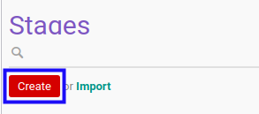
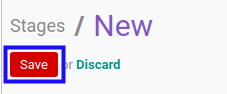

# Membuat Task Stage

## A. INPUT

*(Tidak ada instruksi khusus)*

## B. LANGKAH KERJA

1. Buka menu **Project -> Configuration -> Stages -> Task Stages**. Abaikan jika sudah berada pada menu yang dimaksud.
2. Klik tombol **Create** pada bagian atas-kiri form.

3. Isi **[Stage Name](./penjelasan.md#field-name)**. Wajib diisi.
4. Isi **[Sequence](./penjelasan.md#field-sequence)**. Tidak wajib diisi.
5. Aktifkan/ Deaktifkan **[Default for New Projects](./penjelasan.md#field-case-default)**. Tidak wajib diisi.
6. Aktifkan/ Deaktifkan **[Folded in Kanban View](./penjelasan.md#field-fold-kanban)**. Tidak wajib diisi.
7. Aktifkan/ Deaktifkan **[Folded in Statusbar](./penjelasan.md#field-fold-status)**. Tidak wajib diisi.
8. Pilih **[State](./penjelasan.md#field-state)**. Tidak wajib diisi.
9. Klik tombol **Save** pada bagian atas-kiri form.

## C. OUTPUT

* Data *Task Stage* akan terbuat.
