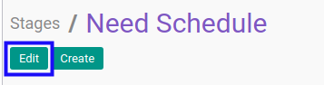

# Memodifikasi Task Stage

## A. INPUT

* User yang akan memodifikasi harus memiliki akses untuk memodifikasi *Task Stage*.

## B. LANGKAH KERJA

1. Buka menu **Project -> Configuration -> Stages -> Task Stages**. Abaikan jika sudah berada pada menu yang dimaksud.
2. Buka data *Task Stage* yang akan dimodifikasi. Abaikan jika data sudah dibuka.
3. Klik tombol **Edit** pada bagian atas-kiri form.

4. Isi dan sesuaikan **[Stage Name](./penjelasan.md#field-name)** jika dibutuhkan. Wajib diisi.
5. Isi dan sesuaikan **[Sequence](./penjelasan.md#field-sequence)** jika dibutuhkan. Wajib diisi.
6. Aktifkan/ Deaktifkan **[Default for New Projects](./penjelasan.md#field-case-default)** jika dibutuhkan.
7. Aktifkan/ Deaktifkan **[Folded in Kanban View](./penjelasan.md#field-fold-kanban)** jika dibutuhkan.
8. Aktifkan/ Deaktifkan **[Folded in Statusbar](./penjelasan.md#field-fold-status)** jika dibutuhkan.
9. Pilih dan sesuaikan **[State](./penjelasan.md#field-state)** jika dibutuhkan. Wajib diisi.
10. Klik tombol **Save** pada bagian atas-kiri form.

## C. OUTPUT

* Data *Task Stage* akan berubah sesuai dengan perubahan yang dilakukan.
