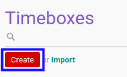

# Membuat Timebox

## A. INPUT

*(Tidak ada instruksi khusus)*

## B. LANGKAH KERJA

1. Buka menu **Project -> Configuration -> Timebox**. Abaikan jika sudah berada pada menu yang dimaksud.
2. Klik tombol **Create** pada bagian atas-kiri form.

3. Isi **[Timebox](./penjelasan.md#field-timebox)**. Wajib diisi.
4. Isi **[Code](./penjelasan.md#field-code)**. Wajib diisi.
5. Aktifkan/ Deaktifkan **[Active](./penjelasan.md#field-active)**. Tidak wajib diisi.
6. Pilih **[Date Start](./penjelasan.md#field-date-start)**. Wajib diisi.
7. Pilih **[Date Stop](./penjelasan.md#field-date-stop)**. Wajib diisi.
8. Beralih ke tab **[Tasks](./penjelasan.md#tab-tasks)**.
9. <a name="l9">[Tambah](./menambah-task.md)/[Hapus](./menghapus-task.md) **Task**</a>. Ulangi langkah ini sampai **Task** sesuai dengan keinginan.
10. Beralih ke tab **[Note](./penjelasan.md#tab-note)**.
11. Isi **[Note](./penjelasan.md#field-note)**. Tidak wajib diisi.
12. Klik tombol **Save** pada bagian atas-kiri form.

## C. OUTPUT

* Data *Timebox* akan terbuat dengan status **New**

