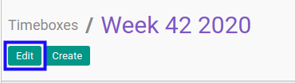
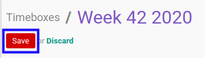

# Memodifikasi Timebox

## A. INPUT

* User yang akan memodifikasi harus memiliki akses untuk memodifikasi *Timebox*.

## B. LANGKAH KERJA

1. Buka menu **Project -> Configuration -> Timebox**. Abaikan jika sudah berada pada menu yang dimaksud.
2. Buka data *Timebox* yang akan dimodifikasi. Abaikan jika data sudah dibuka.
3. Klik tombol **Edit** pada bagian atas-kiri form.

4. Isi dan sesuaikan **[Timebox](./penjelasan.md#field-timebox)** jika dibutuhkan. Wajib diisi.
5. Isi dan sesuaikan **[Code](./penjelasan.md#field-code)** jika dibutuhkan. Wajib diisi.
6. Aktifkan/ Deaktifkan **[Active](./penjelasan.md#field-active)** jika dibutuhkan. Tidak wajib diisi.
7. Pilih dan sesuaikan **[Date Start](./penjelasan.md#field-date-start)** jika dibutuhkan. Wajib diisi.
8. Pilih dan sesuaikan **[Date Stop](./penjelasan.md#field-date-stop)** jika dibutuhkan. Wajib diisi.
9. Beralih ke tab **[Tasks](./penjelasan.md#tab-tasks)**.
10. <a name="l10">[Tambah](./menambah-task.md)/[Hapus](./menghapus-task.md) **Task**</a>. Ulangi langkah ini sampai **Task** sesuai dengan keinginan.
11. Beralih ke tab **[Note](./penjelasan.md#tab-note)**.
12. Isi dan sesuaikan **[Note](./penjelasan.md#field-note)** jika dibutuhkan. Tidak wajib diisi.
13. Klik tombol **Save** pada bagian atas-kiri form.

## C. OUTPUT

* Data *Timebox* akan berubah sesuai dengan perubahan yang dilakukan.
