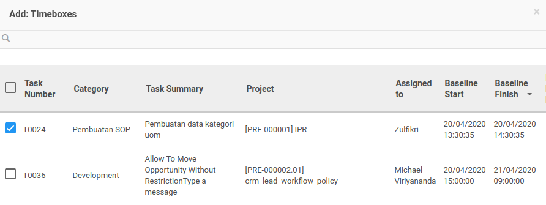

# Menambahkan Task

*(Instruksi kerja ini merupakan sub instruksi dari (1) [Membuat Timebox](./membuat.md), atau (2) [Memodifikasi Timebox](./memodifikasi.md). Instruksi kerja ini tidak bisa berdiri sendiri)*

## A. INPUT

*(Tidak ada instruksi khusus)*

## B. LANGKAH KERJA

1. Klik label **Add an Item** pada bagian atas-kiri tabel ***Task***

Pop-up ***Timeboxes*** akan muncul.

2. Seleksi data produk.
3. Klik tombol **Select** pada bagian bawah-kiri pop-up ***Timeboxes***

4. Lanjutkan [langkah ke-9 instruksi kerja Membuat Timebox](./membuat.md#l9) atau [langkah ke-10 instruksi kerja Memodifikasi Timebox](./memodifikasi.md#l10).

## C. OUTPUT

*(Tidak ada instruksi khusus)*
