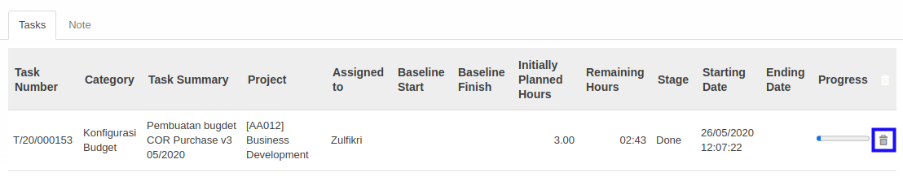

# Menghapus Task

*(Instruksi kerja ini merupakan sub instruksi dari (1) [Membuat Timebox](./membuat.md), atau (2) [Memodifikasi Timebox](./memodifikasi.md). Instruksi kerja ini tidak bisa berdiri sendiri)*

## A. INPUT

*(Tidak ada instruksi khusus)*

## B. LANGKAH KERJA

1. Klik icon tempat sampah pada bagian kanan **Task** yang akan dihapus.

2. Ulangi langkah ke-1 untuk setiap task yang akan dihapus.
3. Lanjutkan [langkah ke-9 instruksi kerja Membuat Timebox](./membuat.md#l9) atau [langkah ke-10 instruksi kerja Memodifikasi Timebox](./memodifikasi.md#l10).

## C. OUTPUT

*(Tidak ada instruksi khusus)*
