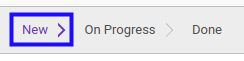

# Merestart Timebox

## A. INPUT

* Data *Timebox* yang akan direstart harus memiliki status **On Progress** atau **Done**.

* User yang akan merestart harus memiliki akses untuk merestart *Timebox*.

## B. LANGKAH KERJA

1. Buka menu **Project -> Configuration -> Timebox**. Abaikan jika sudah berada pada menu yang dimaksud.
2. Buka data *Timebox* yang akan direstart. Abaikan jika data sudah dibuka.
3. Klik tombol **Restart** pada bagian atas-kiri form.

4. Klik tombol **Ok** pada *pop-up* konfirmasi restart yang muncul.

## C. OUTPUT

* Status dari *Timebox* akan berubah menjadi **New**.

* *Timebox* dapat kembali dimodifikasi.
