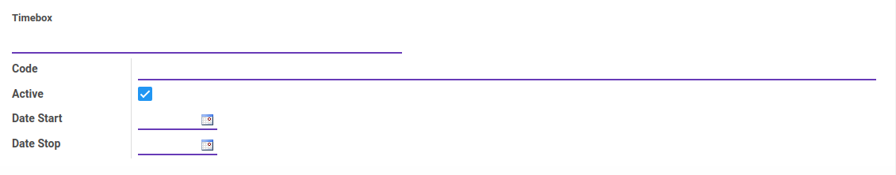
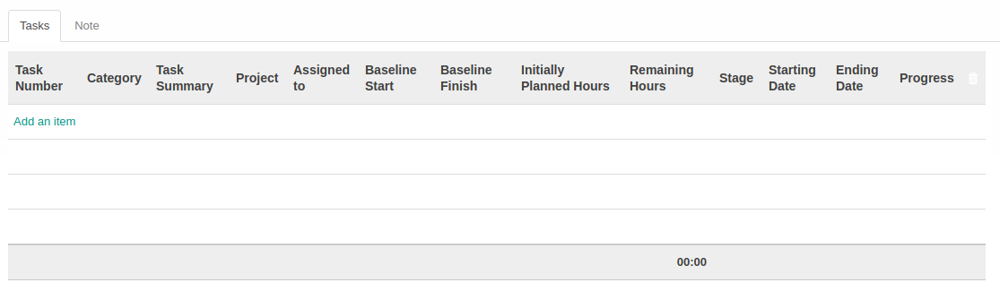
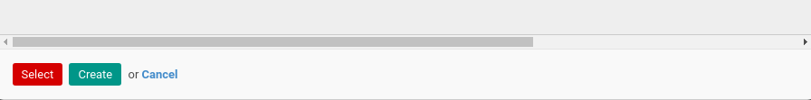
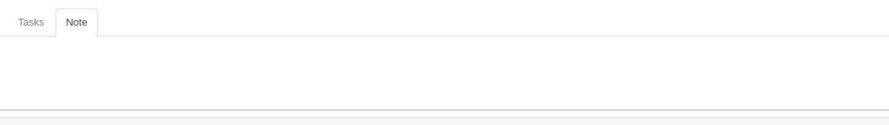

# Penjelasan Timebox

Informasi pada *Timebox* dibagi menjadi beberapa bagian, yaitu:

  * [Header](#bagian-header)
  * [Tab Tasks](#tab-tasks)
  * [Tab Note](#tab-note)

### <a name="bagian-header">HEADER</a>

#### <a name="field-timebox">Timebox</a>

Nama timebox.

#### <a name="field-code">Code</a>

Kode timebox.

#### <a name="field-active">Active</a>

Penanda status timebox aktif.

#### <a name="field-date-start">Date Start</a>

Tanggal mulai timebox.

#### <a name="field-date-stop">Date Stop</a>

Tanggal berakhir timebox.

#### <a name="tab-tasks">TASKS</a>

*Pop Up Timeboxes* saat *add an item* diklik.

#### <a name="field-task-no">Task Number</a>

Nomor task.

#### <a name="field-category">Category</a>

Kategori task.

#### <a name="field-task-summary">Task Summary</a>

Ringkasan task.

#### <a name="field-task-project">Project</a>

Nama project.

#### <a name="field-assigned-to">Assigned To</a>

Nama user yang ditugaskan.

#### <a name="field-baseline-start">Baseline Start</a>

Tanggal awal.

#### <a name="field-baseline-finish">Baseline Finish</a>

Tanggal akhir.

#### <a name="field-initial-plan-hour">Initially Planned Hours</a>

Jumlah rencana jam penyelesaian task.

#### <a name="field-remain-hour">Remaining Hours</a>

Jumlah jam tersisa.

#### <a name="field-stage">Stage</a>

Nama stage (tahapan).

#### <a name="field-start-date">Starting Date</a>

Tanggal mulai task.

#### <a name="field-end-date">Ending Date</a>

Tanggal akhir task.

#### <a name="field-progress">Progress</a>

Persentase kemajuan task.

#### <a name="tab-note">NOTE</a>

#### <a name="field-note">Note</a>

Catatan.
