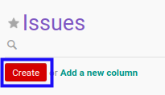

# Membuat Issue

## A. INPUT

*(Tidak ada instruksi khusus)*

## B. LANGKAH KERJA

1. Buka menu **Project -> Project -> Issues**. Abaikan jika sudah berada pada menu yang dimaksud.
2. Klik tombol **Create** pada bagian atas-kiri form.

3. Isi **[Issue](./penjelasan.md#field-name)**. Harus diisi.
4. Pilih **[Tags](./penjelasan.md#field-tags)**. Tidak harus diisi.
5. Pilih **[Assigned To](./penjelasan.md#field-assigned)**. Tidak harus diisi.
6. Pilih **[Contact](./penjelasan.md#field-contact)**. Tidak harus diisi.
7. Isi **[Email](./penjelasan.md#field-email)**. Tidak harus diisi.
8. Pilih **[Project](./penjelasan.md#field-project)**. Tidak harus diisi.
9. Pilih **[Version](./penjelasan.md#field-version)**. Tidak harus diisi.
10. Pilih **[Priority](./penjelasan.md#field-priority)**. Tidak harus diisi.
11. Beralih ke tab **[Description](./penjelasan.md#tab-description)**.
12. Isi **[Description](./penjelasan.md#field-description)**. Tidak harus diisi.
13. Klik tombol **Save** pada bagian atas-kiri form.

## C. OUTPUT

* Data *issue* akan terbuat.
