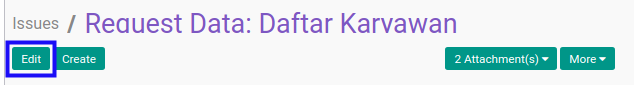

# Memisahkan Issue

## A. INPUT

* User yang akan memisahkan issue harus memiliki akses untuk memodifikasi *Issue*.

## B. LANGKAH KERJA

1. Buka menu **Project -> Project -> Issues**. Abaikan jika sudah berada pada menu yang dimaksud.
2. Buka data *Issue* yang akan dipisahkan. Abaikan jika data sudah dibuka.
3. Klik tombol **Edit** pada bagian atas-kiri form.

4. Beralih ke tab **[Split Issue](./penjelasan.md#tab-split-issue)**.
5. Pilih **[Split Issue From](./penjelasan.md#field-split-issue-split-from)**. Tidak harus diisi.
6. Klik tombol **Save** pada bagian atas-kiri form.

## C. OUTPUT

* Data *Issue* akan terpisah.
