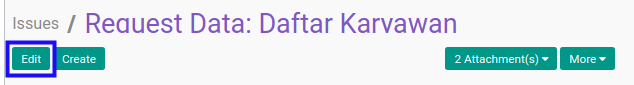

# Memodifikasi Issue

## A. INPUT

* User yang akan memodifikasi harus memiliki akses untuk memodifikasi *Issue*.

## B. LANGKAH KERJA

1. Buka menu **Project -> Project -> Issues**. Abaikan jika sudah berada pada menu yang dimaksud.
2. Buka data *Issue* yang akan dimodifikasi. Abaikan jika data sudah dibuka.
3. Klik tombol **Edit** pada bagian atas-kiri form.

4. Isi dan sesuaikan **[Issue](./penjelasan.md#field-name)** jika dibutuhkan. Harus diisi.
5. Pilih dan sesuaikan **[Tags](./penjelasan.md#field-tags)** jika dibutuhkan. Tidak harus diisi.
6. Pilih dan sesuaikan **[Assigned To](./penjelasan.md#field-assigned)** jika dibutuhkan. Tidak harus diisi.
7. Pilih dan sesuaikan **[Contact](./penjelasan.md#field-contact)** jika dibutuhkan. Tidak harus diisi.
8. Isi dan sesuaikan **[Email](./penjelasan.md#field-email)** jika dibutuhkan. Tidak harus diisi.
9. Pilih dan sesuaikan **[Project](./penjelasan.md#field-project)** jika dibutuhkan. Tidak harus diisi.
10. Pilih dan sesuaikan **[Version](./penjelasan.md#field-version)** jika dibutuhkan. Tidak harus diisi.
11. Pilih dan sesuaikan **[Priority](./penjelasan.md#field-priority)** jika dibutuhkan. Tidak harus diisi.
12. Beralih ke tab **[Description](./penjelasan.md#tab-description)**.
13. Isi dan sesuaikan **[Description](./penjelasan.md#field-description)** jika dibutuhkan. Tidak harus diisi.
14. Klik tombol **Save** pada bagian atas-kiri form.

## C. OUTPUT

* Data *Issue* akan berubah sesuai dengan perubahan yang dilakukan.
