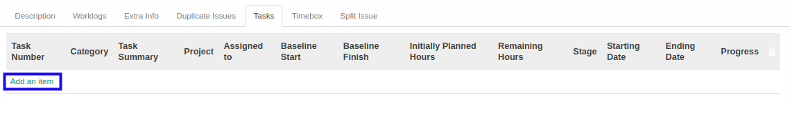
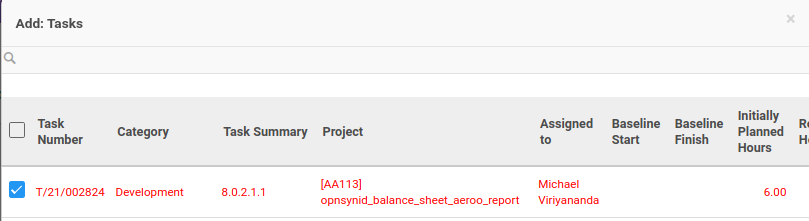
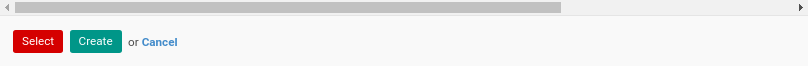

# Menambahkan Task Pada Issue

*(Instruksi kerja ini merupakan sub instruksi dari (1) [Mengaitkan Issue Dengan Task](./mengaitkan-task.md). Instruksi kerja ini tidak bisa berdiri sendiri)*

## A. INPUT

*(Tidak ada instruksi khusus)*

## B. LANGKAH KERJA

1. Klik label **Add an Item** pada bagian atas-kiri tabel ***Tasks***

Pop-up ***Tasks*** akan muncul.

2. Seleksi data *Tasks*.
3. Klik tombol **Select** pada bagian bawah-kiri pop-up ***Debitors***

4. Lanjutkan [langkah ke-5 instruksi kerja Mengaitkan Issue Dengan Task](./mengaitkan-task.md#l5).

## C. OUTPUT

*(Tidak ada instruksi khusus)*
