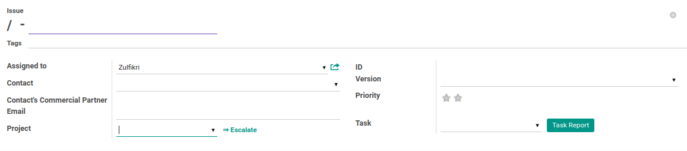
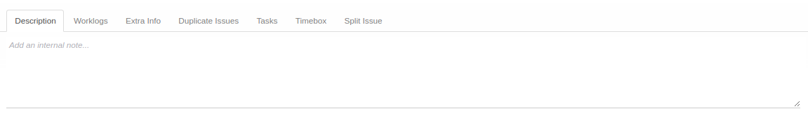
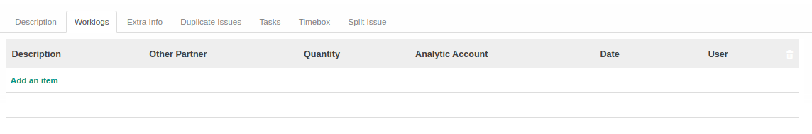
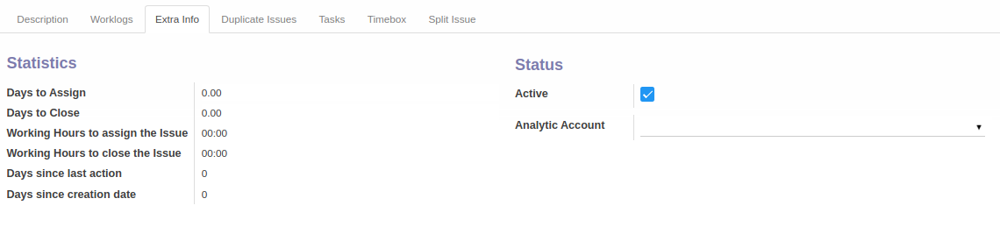
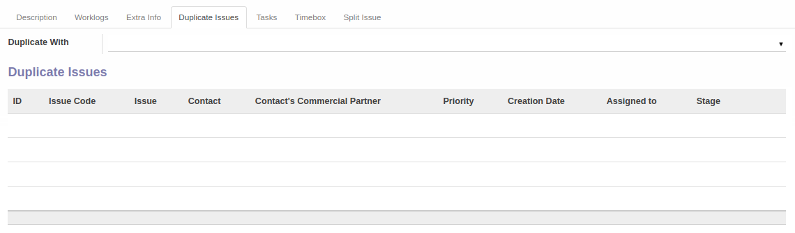
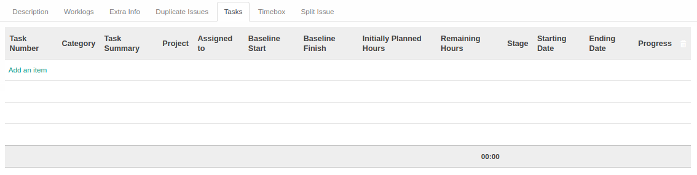
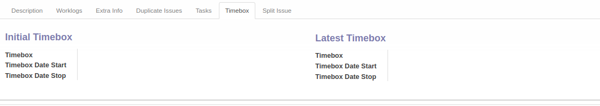
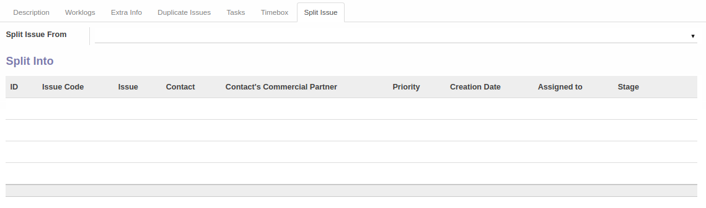

# Penjelasan

Informasi pada *Issue* dibagi menjadi beberapa bagian, yaitu:

* [Header](#bagian-header)
* [Tab Description](#tab-description)
* [Tab Worklogs](#tab-worklogs)
* [Tab Extra Info](#tab-extra-info)
* [Tab Duplicate Issues](#tab-duplicate-issues)
* [Tab Tasks](#tab-tasks)
* [Tab Timebox](#tab-timebox)
* [Tab Split Issue](#tab-split-issue)

### <a name="bagian-header">HEADER</a>

#### <a name="field-name">Issue</a>

Penjelasan singkat *issue*.

#### <a name="field-tags">Tags</a>

Penggolongan *issue*.

#### <a name="field-assigned">Assign To</a>

User yang ditugaskan untuk menyelesaikan *issue*.

#### <a name="field-contact">Contact</a>

Nama kontak yang menyampaikan/memulai *issue*.

#### <a name="field-contact-commercial">Contact's Commercial Partner</a>

Nama perusahaan kontak.

#### <a name="field-email">Email</a>

Alamat email dari Contact

#### <a name="field-project">Project</a>

Nama proyek dimana *issue* terjadi

#### <a name="field-id">ID</a>

ID database *issue*

#### <a name="field-version">Version</a>

Versi *issue*.

#### <a name="field-priority">Priority</a>

Prioritas *issue*.

### <a name="tab-description">DESCRIPTION</a>

#### <a name="field-description">Description</a>

Deskripsi *issue*.

### <a name="tab-worklogs">WORKLOGS</a>

#### <a name="field-worklogs-description">Description</a>

Deskripsi log pekerjaan *issue*.

#### <a name="field-worklogs-other-partner">Other Partner</a>

Nama kontak dimana *issue* terjadi. Hanya diisi apabila Project yang dipilih tidak eksklusif untuk kontak tertentu

#### <a name="field-worklogs-qty">Quantity</a>

Jumlah waktu pekerjaan.

#### <a name="field-worklogs-analytic">Analytic Account</a>

Nama objek biaya yang digunakan untuk pembebanan worklog.

#### <a name="field-worklogs-date">Date</a>

Tanggal log pekerjaan.

#### <a name="field-worklogs-user">User</a>

Nama user yang melakukan log pekerjaan.

### <a name="tab-extra-info">EXTRA INFO</a>

#### <a name="field-days-assign">Days to Assign</a>

Todo.

#### <a name="field-days-close">Days to Close</a>

Todo.

#### <a name="field-hours-assign">Working Hours to Assign the Issue</a>

Todo.

#### <a name="field-hours-close">Working Hours to Close the Issue</a>

Todo.

#### <a name="field-days-action">Days Since Last Action</a>

Todo.

#### <a name="field-days-create">Days Since Creation Date</a>

Todo.

#### <a name="field-active">Active</a>

Penanda status aktif.

#### <a name="field-extra-info-analytic">Analytic Account</a>

Nama objek biaya terkait *issue*.

### <a name="tab-duplicate-issues">DUPLICATE ISSUES</a>

#### <a name="field-duplicate-issues-duplicate-with">Duplicate With</a>

*Issue* awal yang isinya sama dengan *issue* yang sedang dibuka. Hanya diisi apabila *issue* sudah pernah dicatat pada *issue* lain.

### <a name="tab-tasks">TASKS</a>

#### <a name="field-tasks-baseline-start">Baseline Start</a>

Patokan tanggal mulai task.

#### <a name="field-tasks-baseline-finish">Baseline Finish</a>

Patokan tanggal selesai task.

#### <a name="field-tasks-initial-hours">Initially Planned Hours</a>

Rencana awal jumlah jam.

#### <a name="field-tasks-remain-hours">Remaining Hours</a>

Sisa jumlah jam.

#### <a name="field-tasks-stage">Stage</a>

Tahapan penyelesaian task.

#### <a name="field-tasks-start-date">Starting Date</a>

Tanggal mulai task.

#### <a name="field-tasks-end-date">Ending Date</a>

Tanggal selesai task.

#### <a name="field-tasks-progress">Progress</a>

Progress task.

### <a name="tab-timebox">TIMEBOX</a>

### <a name="field-initial-timebox">Initial Timebox</a>

#### <a name="field-initial-timebox-timebox">Timebox</a>

Nama Timebox.

#### <a name="field-initial-timebox-timebox-start">Timebox Date Start</a>

Tanggal mulai timebox.

#### <a name="field-initial-timebox-timebox-stop">Timebox Date Stop</a>

Tanggal berhenti timebox.

### <a name="field-latest-timebox">Latest Timebox</a>

#### <a name="field-latest-timebox-timebox">Timebox</a>

Nama Timebox.

#### <a name="field-latest-timebox-timebox-start">Timebox Date Start</a>

Tanggal mulai timebox.

#### <a name="field-latest-timebox-timebox-stop">Timebox Date Stop</a>

Tanggal berhenti timebox.

### <a name="tab-split-issue">SPLIT ISSUE</a>

#### <a name="field-split-issue-split-from">Split Issue From</a>

*Issue* asal. Hanya diisi apabila *issue* berasal dari *issue* lain. Pemisahan *issue* biasanya terjadi karena ada *issue* dengan banyak pertanyaan/permintaan. *Issue* yang besar dipisah menjadi issue-issue dengan cakupan lebih kecil.

#### <a name="field-split-issue-priority">Priority</a>

Prioritas *issue*.

#### <a name="field-split-issue-creation">Creation Date</a>

Tanggal *issue* dibuat.

#### <a name="field-split-issue-assigned">Assign To</a>

User yang ditugaskan untuk menyelesaikan *issue*.

#### <a name="field-split-issue-stage">Stage</a>

Tahapan penyelesaian *issue*.
