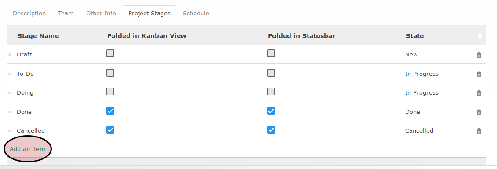
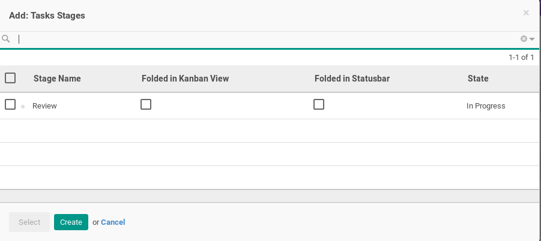
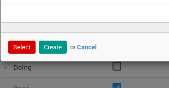

# Menambahkan Project Stages

*(Instruksi kerja ini merupakan sub instruksi dari (1) [Membuat Project Secara Manual](./membuat.md), atau (2) [Memodifikasi Project](./modifikasi.md). Instruksi kerja ini tidak bisa berdiri sendiri)*

## A. INPUT

*(Tidak ada instruksi khusus)*

## B. INSTRUKSI KERJA

1. Klik tombol **_Add an Item_** pada bagian bawah-kiri tabel **_Project Stages_**

Pop-up **_Task Stages_** akan muncul

2. Pilih *task stage* akan akan digunakan
3. Klik tombol **_Select_** pada bagian bawah-kiri pop-up **_Task Stages_**.

4. Lanjutkan ke [langkah ke-21 prosedur Menambah Manual Project](./membuat-manual.md#l21)

## C. OUTPUT

*(Tidak ada instruksi khusus)*
