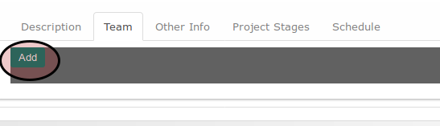
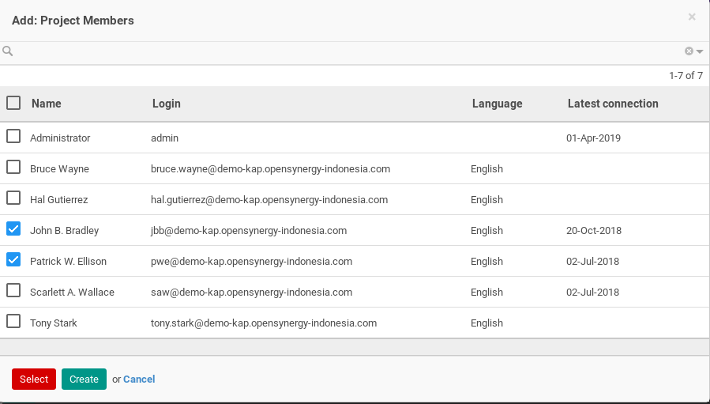
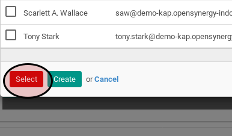

# Menambahkan Tim Proyek

*(Instruksi kerja ini merupakan sub instruksi dari (1) [Membuat Project Secara Manual](./membuat.md), atau (2) [Memodifikasi Project](./modifikasi.md). Instruksi kerja ini tidak bisa berdiri sendiri)*

## A. INPUT

*(Tidak ada instruksi khusus)*

## B. INSTRUKSI KERJA

1. Klik tombol **_Add_** pada bagian atas-kiri tabel **Team**.

Pop-up **_Project Member_** akan muncul

2. Seleksi data tim.
3. Klik tombol **_Select_** pada bagian bawah-kiri pop-up Project Member.

4. Lanjutkan ke [langkah ke-15 prosedur Menambah Manual Project](./membuat-manual.md#l15)

## C. OUTPUT

*(Tidak ada instruksi khusus)*
