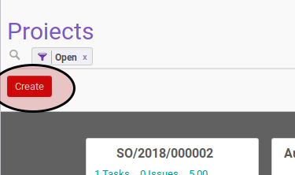
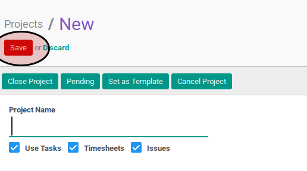

# Secara Manual

## A. INPUT

## B. LANGKAH KERJA

1. Klik tombol **_Create_** pada bagian atas-kiri form.

1. Isi [**_Project Name_**](./penjelasan.md#field-project-name). Harus diisi.
2. Aktifkan [**_Use Task_**](./penjelasan.md#field-use-task) jika dibutuhkan.
3. Aktifkan [**_Timesheet_**](./penjelasan.md#field-timesheet) jika dibutuhkan.
4. Aktifkan [**_Issue_**](./penjelasan.md#field-issue) jika dibutuhkan.
5. Isi [**_Project Manager_**](./penjelasan.md#field-project-manager). Tidak harus diisi.
6. Isi [**_Customer_**](./penjelasan.md#field-customer). Tidak harus diisi.
7. Abaikan [**_Project Template_**](./penjelasan.md#field-project-template). Tidak harus diisi.
8. Isi [**_Email Alias_**](./penjelasan.md#field-email-alias). Tidak harus diisi.
9. Pilih [**_Incoming Emails Create_**](./penjelasan.md#field-incoming-email-create). Abaikan jika isian [**_Email Alias_**](./penjelasan.md#field-email-alias) kosong.
10. Pilih [**_Accept Emails From_**](./penjelasan.md#field-accept-email-from). Abaikan jika isian [**_Email Alias_**](./penjelasan.md#field-email-alias) kosong.
11. Buka tab **_Description_**
12. Isi [**_Description_**](./penjelasan.md#field-description). Tidak harus diisi.
13. Buka tab **_Team_**
14. Untuk setiap orang yang tergabung dalam *project* lakukan prosedur [Penambahan Tim Proyek](./membuat-manual-tim.md).
15. <a name="l15">Buka</a> tab **_Other Info_**.
16. Pilih [**_Privacy/Visibility_**](./penjelasan.md#field-privacy). Harus diisi.
17. Pilih [**_Currency_**](./penjelasan.md#field-currency). Tidak harus diisi.
18. Pilih [**_Parent_**](./penjelasan.md#field-parent). Harus diisi.
19. Buka tab **_Project Stages_**. Harus diisi.
20. <a name="l21">Untuk</a> setiap tahapan yang diinginkan lakukan prosedur [Penambahan Project Stages](./membuat-manual-stage.md).
21. Pilih [**_Timezone_**](./penjelasan.md#field-timezone). Tidak harus diisi.
22. Pilih [**_Start Schedule Based On_**](./penjelasan.md#field-start-schedule-base-on). Harus diisi. Lanjutkan ke langkah ke-23 apabila isian sama dengan **_Manual_**. Lanjutkan ke langkah ke-24 apabila isian tidak sama dengan **_Manual_**.
23. Isi [**_Manual Baseline Start_**](./penjelasan.md#field-manual-baseline-start). Lanjutkan ke langkah ke-28.
24. Pilih [**_Project Based Schedule_**](./penjelasan.md#field-project-based-schedule-start).
25. Pilih [**_Task Based Schedule_**](./penjelasan.md#field-task-based-schedule-start).
26. Pilih [**_Baseline Start Offset_**](./penjelasan.md#field-baseline-start-offset).
27. Pilih [**_Baseline Start Offset UoM_**](./penjelasan.md#field-baseline-start-offset-uom).
29. Pilih [**_Finish Schedule Based On_**](./penjelasan.md#field-finish-schedule-based-on). Harus diisi. Lanjutkan ke langkah ke-30 apabila isian sama dengan **_Manual_**. Lanjutkan ke langkah ke-31 apabila isian tidak sama dengan **_Manual_**.
30. Isi [**_Manual Baseline Finish_**](./penjelasan.md#field-manual-baseline-finish). Lanjutkan ke langkah ke-35.
31. Pilih [**_Project Based Schedule_**](./penjelasan.md#field-project-based-schedule-finish).
32. Pilih [**_Task Based Schedule_**](./penjelasan.md#field-task-based-schedule-finish).
33. Pilih [**_Baseline Finish Offset_**](./penjelasan.md#field-baseline-finish-offset).
34. Pilih [**_Baseline Finish Offset UoM_**](./penjelasan.md#field-baseline-finish-offset-uom).
35. Klik tombol **_Save_** pada bagian atas-kanan form.

