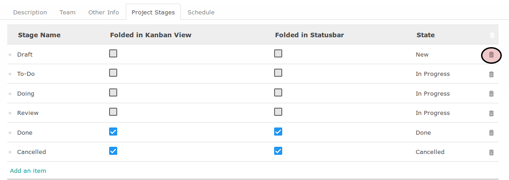

# Menghapus Project Stages

*(Instruksi kerja ini merupakan sub instruksi dari (1) [Membuat Project Secara Manual](./membuat.md), atau (2) [Memodifikasi Project](./modifikasi.md). Instruksi kerja ini tidak bisa berdiri sendiri)*

## A. INPUT

*(Tidak ada instruksi khusus)*

## B. INSTRUKSI KERJA

1. <a name="l1">Klik</a> icon tempat sampah pada bagian kanan data project stages yang akan dihapus.

2. Ulangi [langkah ke-1](#l1) untuk setiap project stage yang akan dihapus.
3. Lanjutkan [langkah ke-20 instruksi Menambahkan Project Secara Manual](./membuat-manual.md#l20).

## C. OUTPUT

*(Tidak ada instruksi khusus)*
