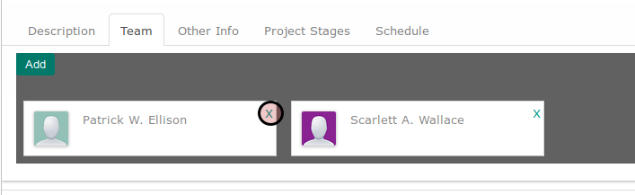

# Menghapus Tim Proyek

*(Instruksi kerja ini merupakan sub instruksi dari (1) [Membuat Project Secara Manual](./membuat.md), atau (2) [Memodifikasi Project](./modifikasi.md). Instruksi kerja ini tidak bisa berdiri sendiri)*

## A. INPUT

*(Tidak ada instruksi khusus)*

## B. INSTRUKSI KERJA

1. <a name="l1">Klik</a> icon x pada bagian pojok atas-kanan kotak yang berisi nama anggota tim

2. Ulangi [langkah ke-1](#l1) untuk setiap anggota tim yang akan dihapus.
3. Lanjutkan [langkah ke-14 instruksi Menambahkan Project Secara Manual](./membuat-manual.md#l14).

## C. OUTPUT

*(Tidak ada instruksi khusus)*
