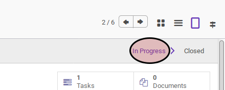

# Menghapus Project

## A. INPUT

* Data project yang akan dimodifikasi harus mempunyai status **In Progress**.

## B. LANGKAH KERJA

1. Buka menu **Project -> Project -> Projects**. Abaikan jika sudah berada pada menu yang dimaksud.
2. Buka data project yang akan dimodifikasi. Abaikan jika data sudah dibuka.
3. Klik tombol **More** pada bagian atas-tengah form.

4. Klik tombol **Delete** pada drop-down yang muncul pada tombol **More**.

5. Klik **Ok** pada diaalog konfirmasi penghapusan.

## C. OUTPUT

* Data project akan terhapus.
