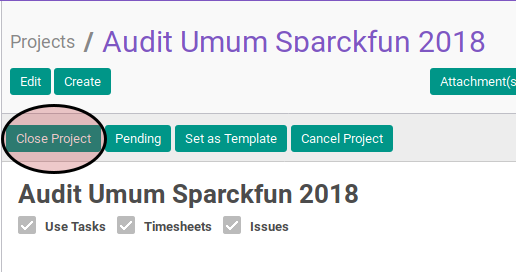
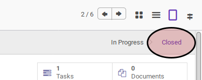

# Menyelesaikan Project

## A. INPUT

* Data project yang akan diselesaikan harus mempunyai status **In Progress**.

## B. LANGKAH KERJA

1. Buka menu **Project -> Project -> Projects**. Abaikan jika sudah berada pada menu yang dimaksud.
2. Buka data project yang akan diselesaikan. Abaikan jika data sudah dibuka.
3. Klik tombol **Close Project** pada bagian atas-kiri form.

## C. OUTPUT

* Status dari project akan berubah menjadi **Closed**.

