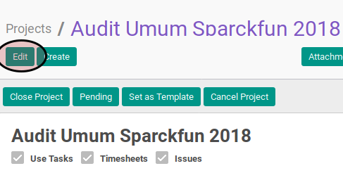

# Memodifikasi Project

## A. INPUT

* Data project yang akan dimodifikasi harus mempunyai status **In Progress**.

## B. LANGKAH KERJA

1. Buka menu **Project -> Project -> Projects**. Abaikan jika sudah berada pada menu yang dimaksud.
2. Buka data project yang akan dimodifikasi. Abaikan jika data sudah dibuka.
3. Klik tombol **Edit** pada bagian atas-kiri form.

4. Isi dan sesuaikan [**_Project Name_**](./penjelasan.md#field-project-name) jika dibutuhkan. Harus diisi.
5. Aktifkan [**_Use Task_**](./penjelasan.md#field-use-task) jika dibutuhkan.
6. Aktifkan [**_Timesheet_**](./penjelasan.md#field-timesheet) jika dibutuhkan.
7. Aktifkan [**_Issue_**](./penjelasan.md#field-issue) jika dibutuhkan.
8. Isi dan sesuaikan [**_Project Manager_**](./penjelasan.md#field-project-manager) jika dibutuhkan. Tidak harus diisi.
9. Isi dan sesuaikan [**_Customer_**](./penjelasan.md#field-customer) jika dibutuhkan. Tidak harus diisi.
10. Abaikan [**_Project Template_**](./penjelasan.md#field-project-template).
11. Isi dan sesuaikan [**_Email Alias_**](./penjelasan.md#field-email-alias) jika dibutuhkan. Tidak harus diisi.
12. Pilih dan sesuaikan [**_Incoming Emails Create_**](./penjelasan.md#field-incoming-email-create) jika dibutuhkan. Abaikan jika isian [**_Email Alias_**](./penjelasan.md#field-email-alias) kosong.
13. Pilih dan sesuaikan [**_Accept Emails From_**](./penjelasan.md#field-accept-email-from) jika dibutuhkan. Abaikan jika isian [**_Email Alias_**](./penjelasan.md#field-email-alias) kosong.
14. Buka tab **_Description_**
15. Isi dan sesuaikan [**_Description_**](./penjelasan.md#field-description) jika dibutuhkan. Tidak harus diisi.
16. Buka tab **_Team_**
17. <a name="l14">[Tambahkan](./membuat-manual-tim.md)</a>/[Hapus](./menghapus-tim.md) Project Team. Ulangi langkah ini sampai Project Team sesuai dengan keinginan.
18. <a name="l15">Buka</a> tab **_Other Info_**.
19. Pilih dan sesuaikan [**_Privacy/Visibility_**](./penjelasan.md#field-privacy) jika dibutuhkan. Harus diisi.
20. Pilih dan sesuaikan [**_Currency_**](./penjelasan.md#field-currency) jika dibutuhkan. Tidak harus diisi.
21. Pilih dan sesuaikan [**_Parent_**](./penjelasan.md#field-parent) jika dibutuhkan. Harus diisi.
22. Buka tab **_Project Stages_**.
23. <a name="l20">[Tambah](./membuat-manual-stage.md)/[Hapus](./menghapus-stages.md)</a> **Project Stages**. Ulangi langkah ini sampai **Project Stages** sesuai keinginan.
24. Pilih dan sesuaikan [**_Timezone_**](./penjelasan.md#field-timezone) jika dibutuhkan. Tidak harus diisi.
25. Pilih dan sesuaikan [**_Start Schedule Based On_**](./penjelasan.md#field-start-schedule-base-on) jika dibutuhkan. Harus diisi. Lanjutkan ke langkah ke-23 apabila isian sama dengan **_Manual_**. Lanjutkan ke langkah ke-24 apabila isian tidak sama dengan **_Manual_**.
26. Isi dan sesuaikan [**_Manual Baseline Start_**](./penjelasan.md#field-manual-baseline-start) jika dibutuhkan. Lanjutkan ke langkah ke-28.
27. Pilih dan sesuaikan [**_Project Based Schedule_**](./penjelasan.md#field-project-based-schedule-start).
28. Pilih dan sesuaikan [**_Task Based Schedule_**](./penjelasan.md#field-task-based-schedule-start) jika dibutuhkan.
29. Pilih dan sesuaikan [**_Baseline Start Offset_**](./penjelasan.md#field-baseline-start-offset) jika dibutuhkan.
30. Pilih dan sesuaikan [**_Baseline Start Offset UoM_**](./penjelasan.md#field-baseline-start-offset-uom) jika dibutuhkan.
31. Pilih dan sesuaikan [**_Finish Schedule Based On_**](./penjelasan.md#field-finish-schedule-based-on) jika dibutuhkan. Harus diisi. Lanjutkan ke langkah ke-30 apabila isian sama dengan **_Manual_**. Lanjutkan ke langkah ke-31 apabila isian tidak sama dengan **_Manual_**.
32. Isi dan sesuaikan [**_Manual Baseline Finish_**](./penjelasan.md#field-manual-baseline-finish) jika dibutuhkan. Lanjutkan ke langkah ke-35.
33. Pilih dan sesuaikan [**_Project Based Schedule_**](./penjelasan.md#field-project-based-schedule-finish) jika dibutuhkan.
34. Pilih dan sesuaikan [**_Task Based Schedule_**](./penjelasan.md#field-task-based-schedule-finish) jika dibutuhkan.
35. Pilih dan sesuaikan [**_Baseline Finish Offset_**](./penjelasan.md#field-baseline-finish-offset) jika dibutuhkan.
36. Pilih dan sesuaikan [**_Baseline Finish Offset UoM_**](./penjelasan.md#field-baseline-finish-offset-uom) jika dibutuhkan.
37. Klik tombol **_Save_** pada bagian atas-kanan form.

## C. OUTPUT

* Data project akan terbuat dengan status **In Progress**
