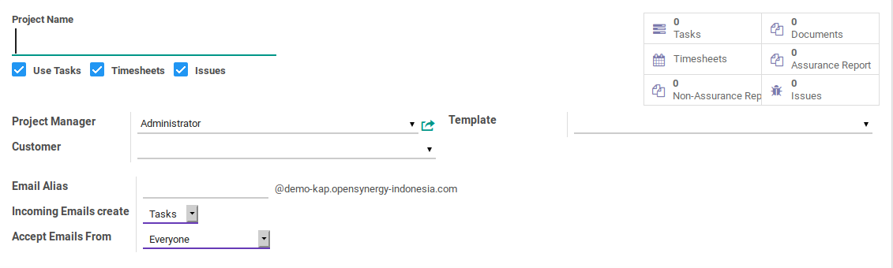
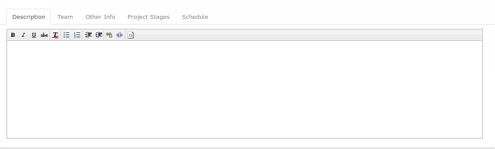
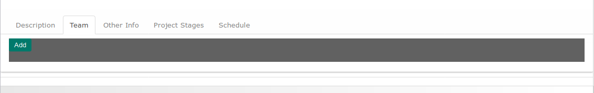
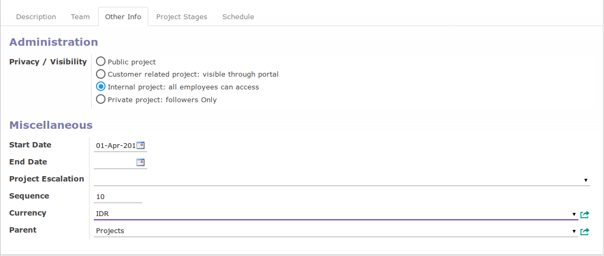
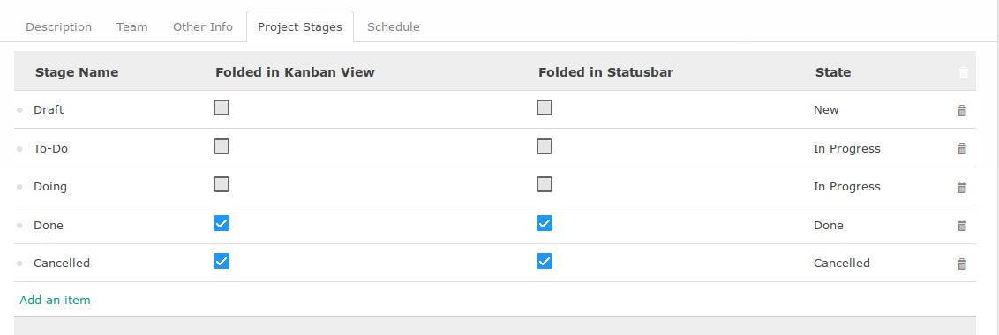
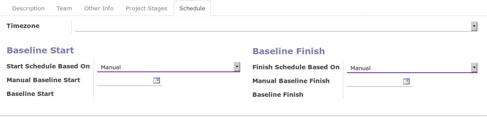

# Penjelasan

## <a name="bagian-header">A. BAGIAN HEADER</a>

#### <a name="field-project-name">Project Name</a>

Nama project

#### <a name="field-use-taske">Use Tasks</a>

Apabila diaktifkan maka fitur task dapat digunakan pada project

#### <a name="field-timesheet">Timesheet</a>

Apabila diaktifkan maka user dapat memilih project tersebut pada entry timesheet detail

#### <a name="field-issue">Timesheet</a>

Apabila diaktifkan maka fitur issue dapat digunakan pada project

#### <a name="field-project-manager">Project Manager</a>

Nama *project manager*

#### <a name="field-customer">Customer</a>

Kepemilikan project. Apabila tidak diisi artinya project tersebut merupakan project internal

#### <a name="field-template">Project Template</a>

Template project yang digunakan

#### <a name="field-email-alias">Email Alias</a>

#TODO

#### <a name="field-incoming-email-create">Incoming Email Create</a>

#TODO

#### <a name="field-accept-email-from">Accept Email From</a>

#TODO

## <a name="tab-description">B. DESCRIPTION</a>

#### <a name="field-description">Description</a>

Deskripsi *project*

## <a name="tab-team">C. TAB TEAM</a>

#### <a name="field-team">Teams</a>

Tim yang mengerjakan project

## <a name="tab-other-info">D. TAB OTHER INFO</a>

#### <a name="field-privacy">Privacy/Visibility</a>

Terdapat beberapa pilihan:

* **_Public Project_**. Project dan task dapat dilihat oleh semua orang. Pengunjung website juga dapat melihat project berserta task pada website (apabila integrasi dengan website diaktifkan)
* **_Customer Related Project_** Project dan task dapat dilihat oleh tim dan konsumen terkait (melalui portal, apabila fitur portal diaktifkan)
* **_Internal Project_** Project dan task dapat dilihat oleh tim
* **_Private Project_** Project dan task hanya dapat dilihat oleh *follower* project

#### <a name="field-start-date">Start Date</a>

Abaikan

#### <a name="field-end-date">End Date</a>

Abaikan

#### <a name="field-project-escalation">Project Escalation</a>

Abaikan

#### <a name="field-sequence">Sequence</a>

Urutan kemunculan project

#### <a name="field-currency">Currency</a>

Mata uang dasar yang digunakan untuk menghitung *cost & revenue project*

#### <a name="field-parent">Parent</a>

Kode biaya induk

## <a name="tab-project-stage">E. TAB PROJECT STAGES</a>

#### <a name="tabel-project-stage">Tabel Project Stage</a>

Tahapan-tahapan yang akan digunakan oleh *task* project

## <a name="tab-schedule">C. TAB SCHEDULE</a>

#### <a name="field-timezone">Timezone</a>

Zona waktu yang digunakan dalam menghitung jadwal *project*

#### <a name="field-start-schedule-based-on">Start Schedule Based On</a>

Patokan tanggal mulai project. Beberapa opsi dapat yang dapat dipilih:

* **_Manual_**. User harus secara manual menentukan tanggal mulai project
* **_Task Baseline Start_**. Tanggal mulai akan dihitung dengan berpatokan pada **_Baseline Start_** yang dimiliki oleh *task* yang dipilih pada isian **_Task Based Schedule_**
* **_Task Baseline Finish_**. Tanggal mulai akan dihitung dengan berpatokan pada **_Baseline Finish_** yang dimiliki oleh *task* yang dipilih pada isian **_Task Based Schedule_**
* **_Project Baseline Start_**. Tanggal mulai akan dihitung dengan berpatokan pada **_Baseline Start_** yang dimiliki oleh *project* yang dipilih pada isian **_Project Based Schedule_**
* **_Project Baseline Finish_**. Tanggal mulai akan dihitung dengan berpatokan pada **_Baseline Finish_** yang dimiliki oleh *project* yang dipilih pada isian **_Project Based Schedule_**

#### <a name="field-project-based-schedule-start">Project Based Schedule</a>

*Project* yang akan digunakan sebagai patokan untuk menentukan tanggal mulai *project*. Hanya muncul apabila isian **_Start Schedule Based On_** tidak sama dengan **_Manual_**

#### <a name="field-task-based-schedule-start">Task Based Schedule</a>

*Task* yang akan digunakan sebagai patokan untuk menentukan tanggal mulai *project*. Hanya muncul apabila isian **_Start Schedule Based On_** tidak sama dengan **_Manual_**

#### <a name="field-baseline-start-offset">Baseline Start Offset</a>

Perhitungan penambahan/pengurangan tanggal mulai

#### <a name="field-baseline-start-offset-uom">Baseline Start Offset UoM</a>

Satuan perhitungan penambahan/pengurangan tanggal mulai

#### <a name="field-finish-schedule-based-on">Finish Schedule Based On</a>

Patokan tanggal selesai project. Beberapa opsi dapat yang dapat dipilih:

* **_Manual_**. User harus secara manual menentukan tanggal selesai project
* **_Task Baseline Start_**. Tanggal selesai akan dihitung dengan berpatokan pada **_Baseline Start_** yang dimiliki oleh *task* yang dipilih pada isian **_Task Based Schedule_**
* **_Task Baseline Finish_**. Tanggal selesai akan dihitung dengan berpatokan pada **_Baseline Finish_** yang dimiliki oleh *task* yang dipilih pada isian **_Task Based Schedule_**
* **_Project Baseline Start_**. Tanggal selesai akan dihitung dengan berpatokan pada **_Baseline Start_** yang dimiliki oleh *project* yang dipilih pada isian **_Project Based Schedule_**
* **_Project Baseline Finish_**. Tanggal selesai akan dihitung dengan berpatokan pada **_Baseline Finish_** yang dimiliki oleh *project* yang dipilih pada isian **_Project Based Schedule_**

#### <a name="field-project-based-schedule-finish">Project Based Schedule</a>

*Project* yang akan digunakan sebagai patokan untuk menentukan tanggal selesai *project*. Hanya muncul apabila isian **_Finish Schedule Based On_** tidak sama dengan **_Manual_**

#### <a name="field-task-based-schedule-finish">Task Based Schedule</a>

*Task* yang akan digunakan sebagai patokan untuk menentukan tanggal selesai *project*. Hanya muncul apabila isian **_Finish Schedule Based On_** tidak sama dengan **_Manual_**

#### <a name="field-baseline-finish-offset">Baseline Finish Offset</a>

Perhitungan penambahan/pengurangan tanggal selesai

#### <a name="field-baseline-finish-offset-uom">Baseline Finish Offset UoM</a>

Satuan perhitungan penambahan/pengurangan tanggal selesai
