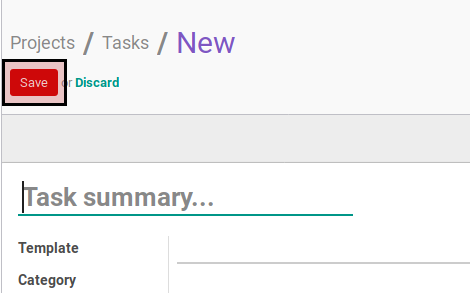

# Memodifikasi Task

## A. INPUT

*(Tidak ada petunjuk khusus)*

## B. INSTRUKSI KERJA

1. Buka menu **Project -> Project -> Projects**. Abaikan jika sudah berada pada menu yang dimaksud.
2. Buka data project yang akan dibuatkan tasknya. Abaikan jika data sudah dibuka.
3. Klik tombol **Tasks** pada bagian atas-kanan form. Tampilan akan berubah ke kanban task.

4. Buka data task yang akan dimodifikasi. Abaikan jika data task sudah dibuka.
5. Klik tombol **Edit** pada bagian atas-kiri form.

6. Isi dan sesuaikan [**Task Summary**](./penjelasan.md#field-name). Harus diisi.
7. Pilih dan sesuaikan [**Template**](./penjelasan.md#field-template). Tidak harus diisi.
8. Pilih dan sesuaikan [**Category**](./penjelasan.md#field-category). Tidak harus diisi.
9. Pilih dan sesuaikan [**Assigned To**](./penjelasan.md#field-assigned-to). Harus diisi.
10. Pilih dan sesuaikan [**Reviewer**](./penjelasan.md#field-reviewer). Harus diisi.
11. Pilih dan sesuaikan [**Tags**](./penjelasan.md#field-tags). Tidak harus diisi.
12. Buka tab [**Description**](./penjelasan.md#tab-description).
13. Isi dan sesuaikan [**Description**](./penjelasan.md#field-description). Tidak harus diisi.
14. Buka tab [**Schedule**](./penjelasan.md#tab-schedule).
15. Sesuaikan [**Priority**](./penjelasan.md#field-priority). Tidak harus diisi.
16. Isi dan sesuaikan [**Sequence**](./penjelasan.md#field-sequence). Tidak harus diisi.
17. Buka tab [**Schedule**](./penjelasan.md#tab-schedule).
18. Pilih dan sesuaikan [**Start Schedule Based On**](./penjelasan.md#field-start-schedule-based-on). Harus diisi. Lanjutkan ke langkah ke-18 apabila isian sama dengan **Manual**. Lanjutkan ke langkah ke-19 apabila isian tidak sama dengan **Manual**.
19. Isi dan sesuaikan [**Manual Baseline Start**](./penjelasan.md#field-manual-baseline-start). Lanjutkan ke langkah ke-23.
20. Pilih dan sesuaikan [**Task Based Schedule**](./penjelasan.md#field-task-based-schedule). Harus diisi.
21. Pilih dan sesuaikan [**Baseline Start Offset**](./penjelasan.md#field-baseline-start-offset). Harus diisi.
22. Pilih dan sesuaikan [**Baseline Start Offset UoM**](./penjelasan.md#field-baseline-start-offset-uom). Harus diisi.
23. Pilih dan sesuaikan [**Finish Schedule Based On**](./penjelasan.md#field-finish-schedule-based-on). Lanjutkan ke langkah ke-23 apabila isian sama dengan **Manual**. Lanjutkan ke langkah ke-24 apabila isian tidak sama dengan **Manual**.
24. Isi dan sesuaikan [**Manual Baseline Finish**](./penjelasan.md#field-manual-baseline-finish). Lanjutkan ke langkah ke-28.
25. Pilih dan sesuaikan [**Task Based Schedule**](./penjelasan.md#field-task-based-schedule). Harus diisi.
26. Pilih dan sesuaikan [**Baseline Finish Offset**](./penjelasan.md#field-baseline-finish-offset). Harus diisi.
27. Pilih dan sesuaikan [**Baseline Finish Offset UoM**](./penjelasan.md#field-baseline-finish-offset-uom). Harus diisi.
28. Buka tab [**Dependencies**](./penjelasan.md#tab-dependencies).
29. <a name="l29">[Tambah](./menambahkan-predecessor.md)/[Modifikasi](./memodifikasi-predecessor.md)/[Hapus](./menghapus-predecessor.md)</a> **Predecessor**. Tidak harus diisi. Lakukan sampai **Predecessor** sesuai dengan keinginan.
30. Klik tombol **Save** pada bagian atas-kiri form.

## C. OUTPUT

* Data task akan berubah sesuai dengan modifikasi yang dibuat
