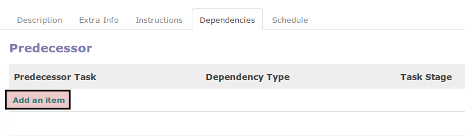

# Menambahkan Task Predecessors

## A. INPUT

*(Instruksi kerja ini merupakan sub instruksi dari (1) [Membuat Task](./membuat.md), atau (2) [Memodifikasi Task](./modifikasi.md). Instruksi kerja ini tidak bisa berdiri sendiri)*

## B. INSTRUKSI KERJA

1. Buka tab **Dependencies**.
2. Klik tombol **Add an Item** pada tabel **Predecessor**

3. Pilih **Predecessor Task**. Harus diisi.
4. Pilih **Dependency Type**. Harus diisi.
5. Lanjutkan ke [langkah ke-28 prosedur **Membuat Task**](./membuat.md#l28) atau langkah ke-29 [Prosedur **Memodifikasi Task**](./memodifikasi.md#l29)

## C. OUTPUT

*(Tidak ada instruksi khusus)*
