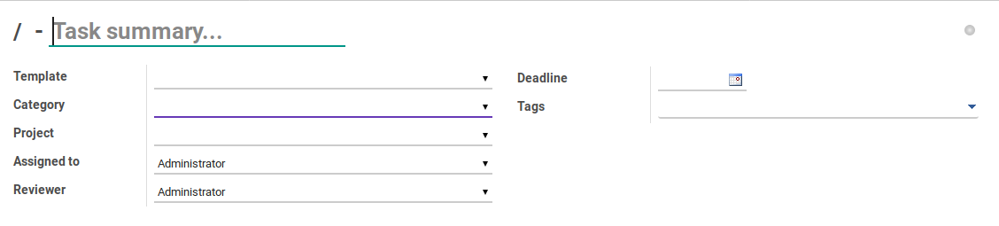
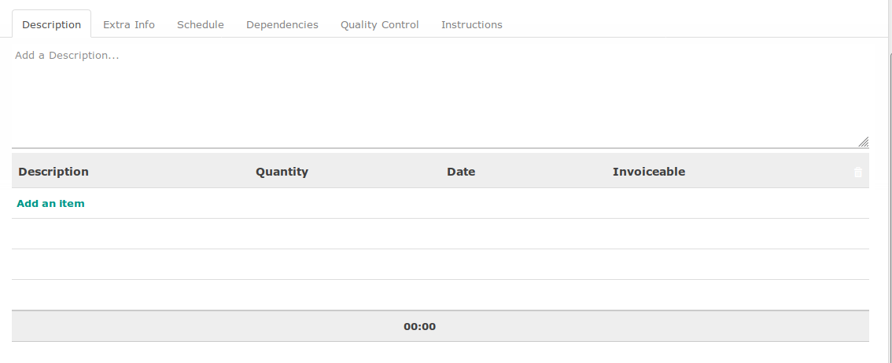
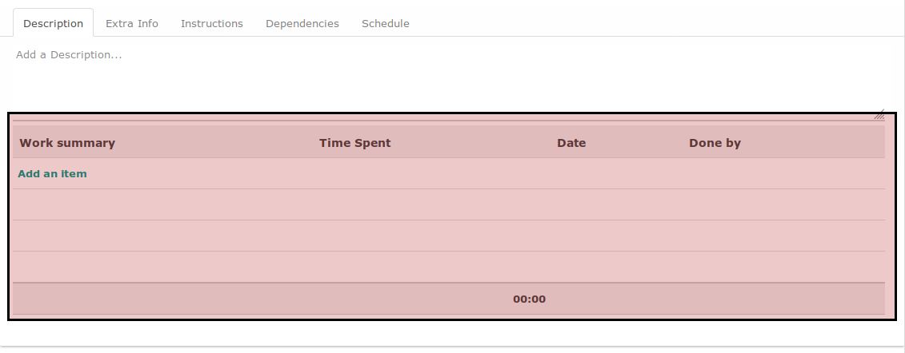
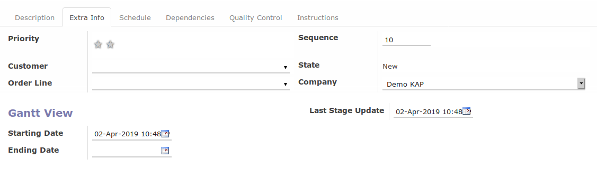
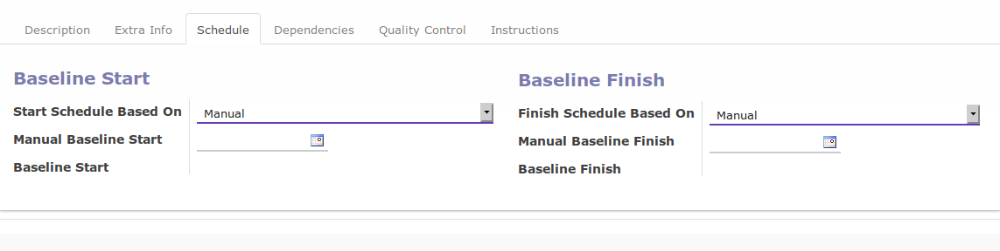
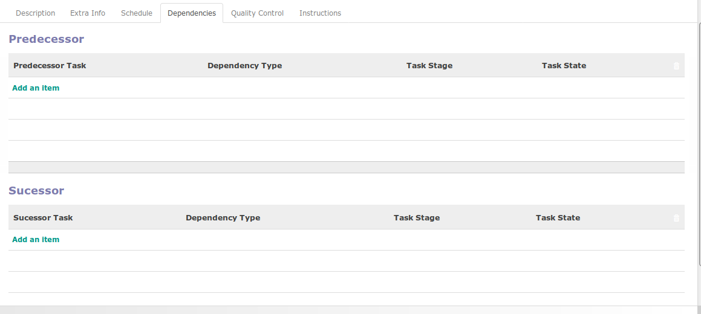
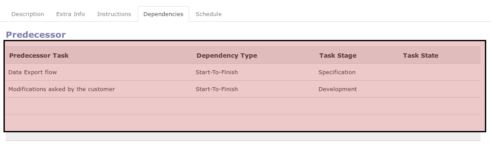
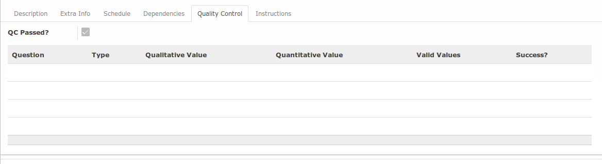
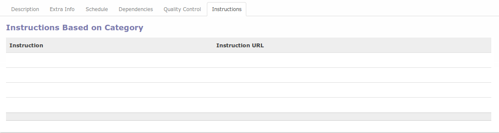

# Penjelasan

## <a name="bagian-header">A. BAGIAN HEADER</a>

#### <a name="field-name">Task Summary</a>

Penjelasan singkat *task*

#### <a name="field-template">Template</a>

Template task yang digunakan

#### <a name="field-category">Category</a>

Kategori task

#### <a name="field-project">Project</a>

Project yang memiliki task tersebut

#### <a name="field-assigned">Assigned To</a>

User yang ditugaskan untuk menyelesaikan task

#### <a name="field-reviwer">Reviewer</a>

User yang ditugaskan untuk mereview penyelesaian task

#### <a name="field-deadline">Deadline</a>

Abaikan

#### <a name="field-tags">Tags</a>

Penggolongan task

## <a name="tab-descrption">B. TAB DESCRIPTION</a>

#### <a name="field-description">Description</a>

Penjelasan task

### <a name="tabel-timesheet">B.1. Tabel Timesheet</a>

Tabel timesheet akan berisi detail pengerjaan dan waktu pengerjaan task

#### <a name="field-timesheet-description">Description</a>

Deskripsi pengerjaan

#### <a name="field-timesheet-quantity">Quantity</a>

Jumlah jam yang digunakan (format HH:MM)

#### <a name="field-timesheet-date">Date</a>

Tanggal timesheet dilakukan

#### <a name="field-timesheet-invoiceable">Invoiceable</a>

Opsi untuk (1) menentukan apakah waktu pengerjaan dapat diinvoice ke konsumen/klien, (2) menentukan berapa proporsi waktu yang dapat diinvoice ke konsumen/klien.

## <a name="tab-extra-info">C. TAB EXTRA INFO</a>

#### <a name="field-priority">Priority</a>

Prioritas task

#### <a name="field-customer">Customer</a>

*(Abaikan)*

#### <a name="field-order-line">Order Line</a>

*(Abaikan)*

#### <a name="field-sequence">Sequence</a>

Urutan task

#### <a name="field-state">State</a>

Status dari task. Berikut adalah beberapa status yang dapat terjadi:

1. **Draft**. Task belum mulai dikerjakan.
2. **On Progress**. Task sedang dikerjakan.
3. **Done**. Task sudah selesai.
4. **Pending**. Task sudah mulai dikerjakan namun pengerjaannya sedang dipending.
5. **Cancel**. Task sudah dibatalkan.

#### <a name="field-company">Company</a>

Pemilik task

#### <a name="field-last-stage-update">Last Stage Update</a>

Waktu terakhir task berubah stage

## <a name="tab-schedule">D. TAB SCHEDULE</a>

#### <a name="field-timezone">Timezone</a>

Zona waktu yang digunakan dalam menghitung jadwal

#### <a name="field-start-schedule-based-on">Start Schedule Based On</a>

Patokan tanggal mulai task. Beberapa opsi dapat yang dapat dipilih:

* **Manual**. User harus secara manual menentukan tanggal mulai task
* **Task Baseline Start**. Tanggal mulai akan dihitung dengan berpatokan pada **Baseline Start** yang dimiliki oleh task yang dipilih pada isian **Task Based Schedule**
* **Task Baseline Finish**. Tanggal mulai akan dihitung dengan berpatokan pada **Baseline Finish** yang dimiliki oleh task yang dipilih pada isian **Task Based Schedule**
* **Project Baseline Start**. Tanggal mulai akan dihitung dengan berpatokan pada **Baseline Start** yang dimiliki oleh project yang dipilih pada isian **Project Based Schedule**
* **Project Baseline Finish**. Tanggal mulai akan dihitung dengan berpatokan pada **Baseline Finish** yang dimiliki oleh project yang dipilih pada isian **Project Based Schedule**

#### <a name="field-project-based-schedule-start">Project Based Schedule</a>

*Project* yang akan digunakan sebagai patokan untuk menentukan tanggal mulai task. Hanya muncul apabila isian **Start Schedule Based On** tidak sama dengan **Manual**

#### <a name="field-task-based-schedule-start">Task Based Schedule</a>

*Task* yang akan digunakan sebagai patokan untuk menentukan tanggal mulai *project*. Hanya muncul apabila isian **Start Schedule Based On** tidak sama dengan **Manual**

#### <a name="field-baseline-start-offset">Baseline Start Offset</a>

Perhitungan penambahan/pengurangan tanggal mulai

#### <a name="field-baseline-start-offset-uom">Baseline Start Offset UoM</a>

Satuan perhitungan penambahan/pengurangan tanggal mulai

#### <a name="field-finish-schedule-based-on">Finish Schedule Based On</a>

Patokan tanggal selesai task. Beberapa opsi dapat yang dapat dipilih:

* **Manual**. User harus secara manual menentukan tanggal selesai project
* **Task Baseline Start**. Tanggal selesai akan dihitung dengan berpatokan pada **Baseline Start** yang dimiliki oleh *task* yang dipilih pada isian **Task Based Schedule**
* **Task Baseline Finish**. Tanggal selesai akan dihitung dengan berpatokan pada **Baseline Finish** yang dimiliki oleh *task* yang dipilih pada isian **Task Based Schedule**
* **Project Baseline Start**. Tanggal selesai akan dihitung dengan berpatokan pada **Baseline Start** yang dimiliki oleh *project* yang dipilih pada isian **Project Based Schedule**
* **Project Baseline Finish**. Tanggal selesai akan dihitung dengan berpatokan pada **Baseline Finish** yang dimiliki oleh *project* yang dipilih pada isian **Project Based Schedule**

#### <a name="field-project-based-schedule-finish">Project Based Schedule</a>

*Project* yang akan digunakan sebagai patokan untuk menentukan tanggal selesai task. Hanya muncul apabila isian **Finish Schedule Based On** tidak sama dengan **Manual**

#### <a name="field-task-based-schedule-finish">Task Based Schedule</a>

*Task* yang akan digunakan sebagai patokan untuk menentukan tanggal selesai *project*. Hanya muncul apabila isian **Finish Schedule Based On** tidak sama dengan **Manual**

#### <a name="field-baseline-finish-offset">Baseline Finish Offset</a>

Perhitungan penambahan/pengurangan tanggal selesai

#### <a name="field-baseline-finish-offset-uom">Baseline Finish Offset UoM</a>

Satuan perhitungan penambahan/pengurangan tanggal selesai

## <a name="tab-dependencies">E. TAB DEPENDENCIES</a>

### <a name="tabel-predecessor">E.1 TABEL PREDECESSOR</a>

Tabel predecessor akan berisi tugas-tugas (task) yang pelaksanaannya mendahului task terkait.

#### <a name="field-predecessor-task">Predecessor Task</a>

Task pendahulu

#### <a name="field-predecessor-dependency-type">Dependency Type</a>

Jenis hubungan dengan predecessor. Terdapat beberapa jenis hubungan yang dapat dipilih:

* **Start-To-Finish**. Predecessor harus dimulai terlebih dahulu sebelum task dapat diselesaikan.
* **Start-To-Start**. Predecessor harus dimulai terlebih dahulu sebelum task dapat dimulai.
* **Finish-To-Start**. Predecessor harus diselesaikan terlebih dahulu sebelum task dapat dimulai.
* **Finish-To-Finish**. Predecessor harus diselesaikan terlebih dahulu sebelum task dapat diselesaikan.

#### <a name="field-predecessor-task-stage">Task Stage</a>

Stage dari task pendahulu

#### <a name="field-predecessor-task-state">Task State</a>

State dari task pendahulu

### <a name="tabel-successor">E.1 TABEL SUCESSOR</a>

Tabel predecessor akan berisi tugas-tugas (task) yang pelaksanaannya didahului oleh task terkait.

#### <a name="field-successor-task">Successor Task</a>

Task lanjutan

#### <a name="field-successor-dependency-type">Dependency Type</a>

Jenis hubungan dengan sucessor. Terdapat beberapa jenis hubungan yang dapat dipilih:

* **Start-To-Finish**. Task harus dimulai terlebih dahulu sebelum predecessor dapat diselesaikan.
* **Start-To-Start**. Task harus dimulai terlebih dahulu sebelum predecessor dapat dimulai.
* **Finish-To-Start**. Task harus diselesaikan terlebih dahulu sebelum predecessor dapat dimulai.
* **Finish-To-Finish**. Task harus diselesaikan terlebih dahulu sebelum predecessor dapat diselesaikan.

#### <a name="field-successor-task-stage">Task Stage</a>

Stage dari task lanjutan

#### <a name="field-successor-task-state">Task State</a>

State dari task lanjutan

## <a name="tab-schedule">F. TAB QUALITY CONTROL</a>

#### <a name="field-qc-pass">QC Passed?</a>

QC Passed akan bernilai True apabila semua pertanyaan pada tabel quality control lolos uji (ditandai dengan nilai True pada field **Success**). Bernilai False apabila salah satu pertanyaan pada tabel quality control tidak lolos uji (ditandai dengan nilai False pada field **Success**)

### <a name="tabel-qc">F.1 TABEL QUALITY CONTROL</a>

Tabel quality control akan berisi item-item pengujian yang dibutuhkan agar task dapat diselesaikan.

#### <a name="field-qc-question">Question</a>

Pertanyaan yang akan diuji

#### <a name="field-qc-type">Type</a>

Tipe item pengujian, yaitu:

1. Quantitative: User harus menyediakan jawaban atas pertanyaan yang akan diuji dalam bentuk angka.
2. Qualitative: User harus memilih jawaban atas pertanyaan yang akan diuji.

#### <a name="field-qc-qualitative-value">Qualitative Value</a>

Jawaban dari pertanyaan (jika isian Type sama dengan Qualitative)

#### <a name="field-qc-quantitative-value">Quantitative Value</a>

Jawaban dari pertanyaan (jika isian Type sama dengan Quantitative)

#### <a name="field-qc-valid-value">Valid Value</a>

Jawaban yang dibutuhkan agar item pengujian lolos uji

#### <a name="field-qc-success">Success?</a>

Bernilai True apabila jawaban (**Qualitative Value** atau **Quantitative Value**, tergantung Type) sesuai dengan **Valid Value**

## <a name="tab-instruction">G. TAB INSTRUCTION</a>

### <a name="tabel-instruction">G.1 TABEL INSTRUCTION</a>

#### <a name="field-instruction">Instruction</a>

#### <a name="field-instruction-url">Instruction URL</a>
